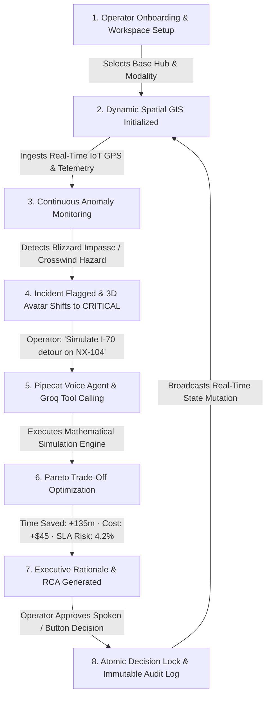

# NEXUS — Enterprise Autonomous Logistics & Spatial Intelligence Platform


[](LICENSE)

**NEXUS** is a mission-critical, enterprise-grade Autonomous Logistics Command, Spatial Intelligence, and What-If Simulation platform. It provides freight forwarders, fleet dispatchers, and operations directors with real-time situational awareness, predictive detour modeling, aerodynamic energy calculations, automated incident Root Cause Analysis (RCA), and a hands-free tactical voice copilot.

---

## 🏛️ System Architecture

NEXUS is engineered as a clean 4-tier monorepo designed for high throughput, sub-second decision making, and strict role-based governance:

```
                               ┌────────────────────────────────────────────────────────┐
                               │                    OPERATOR / CLIENT                   │
                               │        Tactile HUD · 3D Companion Avatar · Voice       │
                               └───────────────────────────┬────────────────────────────┘
                                                           │ (HTTPS / WSS)
                                                           ▼
                               ┌────────────────────────────────────────────────────────┐
                               │             NEXT.JS 15 FRONTEND (APP ROUTER)           │
                               │ • 78 Strict TypeScript Routes                          │
                               │ • MapLibre GL 3D Vector GIS with Weather Polygon Layers│
                               │ • Push-to-Talk Tactical Voice Controller               │
                               │ • Procedural Web Audio Synthesizer & Dynamic Themes    │
                               └───────────────────────────┬────────────────────────────┘
                                                           │ (REST / WebSockets)
                                                           ▼
                               ┌────────────────────────────────────────────────────────┐
                               │             FASTAPI ASYNCHRONOUS BACKEND               │
                               │ • RBAC Governance & Session Security                   │
                               │ • Geoapify Multi-Tier Geocoding, Routing & Matrix Cache│
                               │ • Open-Meteo Road Weather & Blizzard Hazard Engine     │
                               │ • Deterministic Aerodynamic Simulation Physics Engine  │
                               │ • Native Pipecat AI Voice Pipeline & Frame Processor   │
                               │ • Groq LLaMA-3.3-70B Tool Caller (Sub-400ms Inference) │
                               └───────────────────────────┬────────────────────────────┘
                                                           │
                      ┌────────────────────────────────────┴────────────────────────────────────┐
                      ▼                                                                         ▼
┌──────────────────────────────────────────────┐              ┌──────────────────────────────────────────────┐
│       NEON POSTGRESQL & PRISMA ORM           │              │     MICROSOFT FABRIC & IOT INGESTION         │
│ • Optimistic Concurrency Locking             │              │ • High-Throughput Vehicle Telemetry Ingest   │
│ • Multi-Tenant Workspace Partitions          │              │ • Delta Lake Historical Analytics            │
│ • Immutable Audit Logs & Event Streams       │              │ • 1.2M+ Daily Event Stream Processing        │
└──────────────────────────────────────────────┘              └──────────────────────────────────────────────┘
```

---

## 🔄 End-to-End Operational Workflow

NEXUS operates as a continuous closed-loop operational cycle:



### 1. Dynamic Onboarding & Hub Initialization (Zero Hardcoding)
* Operators configure their organization scope, industry modality (Cold Chain, Freight Forwarding, Last-Mile), and primary distribution hub via **Geoapify Place Autocomplete**.
* The platform dynamically anchors the MapLibre 3D GIS viewport, warehouse cluster markers, and weather radar to the user's chosen coordinates.

### 2. Live Spatial World & Hazard Tracking
* Live vehicle GPS telemetry, speed, heading, and battery state-of-charge (SoC) stream across the vector map.
* **Open-Meteo Meteorological Engine** projects active blizzard polygons, road icing warnings, and high-crosswind hazard zones onto the highway corridors.

### 3. Tactical Voice Copilot (Powered by Pipecat AI & Groq)
* Operators use hands-free natural voice commands via the floating HUD companion.
* Spoken utterances are parsed by **Groq LLaMA-3.3-70B** with function calling, executing physical UI actions:
  * *"Fly map to Denver hub"* → Map camera immediately swoops to the coordinates.
  * *"Simulate I-70 detour on vehicle NX-104"* → Runs mathematical What-If physics simulation.
  * *"Filter vehicles below 30% battery"* → Highlights low-charge haulers.

### 4. Deterministic Simulation Physics Engine
* Evaluates alternative corridors using exact physical equations:
  * **Aerodynamic Drag**: $F_{\text{aero}} = \frac{1}{2} \rho C_d A v^2$
  * **Rolling Resistance**: $F_{\text{roll}} = C_r m g$
  * **SLA Survival Risk Probability**: Normal CDF integral of scheduled delivery buffers.
  * **Multi-Objective Pareto Decision Scoring** (0 – 100).

### 5. Atomic Decision Execution & Immutable Governance
* Approved route diversions and fleet re-assignments are committed using **optimistic concurrency locking** to prevent race conditions.
* Every action is stamped into the immutable cryptographic audit ledger with actor ID, timestamp, and metadata diffs.

---

## 📁 Repository Directory Structure

The project follows a clean monorepo hierarchy:

```
nexus/
├── backend/                             # Python 3.13 FastAPI Backend
│   ├── app/
│   │   ├── api/v1/endpoints/            # REST & WebSocket API Routers (Auth, Voice, Weather, Location, Sim)
│   │   ├── core/                        # Configuration, Caching, Security, JWT, Error Handlers
│   │   ├── db/                          # Database Session & Base Engine
│   │   ├── integrations/                # Location (Geoapify) & Weather (Open-Meteo) Providers
│   │   ├── models/                      # SQLAlchemy ORM Models (User, Workspace, Vehicle, Incident)
│   │   ├── schemas/                     # Pydantic DTOs & Validation Schemas
│   │   ├── services/                    # Domain Services (AI, Location, Simulation Engine, Incidents)
│   │   └── voice/                       # Pipecat AI Framework Bot, Tools, and Frame Processors
│   ├── requirements.txt                 # Backend Python Dependencies
│   └── pyproject.toml                   # Pytest & Tooling Configuration
│
├── frontend/                            # Next.js 15 App Router Frontend
│   ├── app/
│   │   ├── (auth)/                      # Split-Screen 3D Login, Signup, Password Recovery
│   │   ├── (onboarding)/                # Welcome, Role Selection, Workspace, Environment Setup
│   │   └── (app)/                       # Core Views (Overview, Live World, Sim, Admin)
│   ├── components/
│   │   ├── avatar/                      # 3D Procedural Companion Avatar & Global Sliding Widget
│   │   ├── brand/                       # 3D WebGL Hero & 7-Stage Scrollytelling Journey
│   │   ├── location/                    # Location Search & Picker with Debounced Autocomplete
│   │   ├── map/                         # MapLibre 3D GIS Map, Route Renderers, and Hazard Polygons
│   │   ├── simulation/                  # What-If Scenario Builder & Matrix Visualizer
│   │   ├── voice/                       # Voice Companion Controller & Audio Waveform Visualizer
│   │   └── ui/                          # Tactile Glassmorphism Components, Drawers, & Modals
│   ├── lib/                             # Sound Synthesizer, State Stores, Utilities, API Clients
│   └── tailwind.config.ts               # Custom Color Tokens, Elevation & Animation Presets
│
├── database/                            # Database Layer & Migrations
│   ├── prisma/
│   │   └── schema.prisma                # PostgreSQL Database Schema
│   └── migrations/                      # Versioned Schema Migrations
│
├── tests/                               # Comprehensive Automated Test Suites
│   └── backend/
│       ├── test_admin_and_governance.py # RBAC, Audit Ledger & Telemetry Pipeline Tests
│       ├── test_adversarial_challenge.py# Boundary, Error & Invalid State Rejection Tests
│       ├── test_ai_service.py           # Groq AI Inference, RCA & Briefing Tests
│       ├── test_auth_security.py        # Password Hashing, JWT Verification & Access Control
│       ├── test_challenger_m1.py        # Dynamic Baseline & Route Optimization Tests
│       ├── test_full_operational_vertical_slice.py # End-to-End Operational Lifecycle Integration
│       ├── test_incident_service.py     # Incident State Transitions & Severity Escalation
│       ├── test_location_service.py     # Geoapify Geocoding, Routing & Multi-Tier Caching
│       ├── test_remediation_regression.py # Regression & Edge Case Validation Suite
│       ├── test_simulation_engine.py    # Aerodynamic Energy & Delay Recovery Calculation Tests
│       ├── test_user_and_auth_lifecycle.py # Wrong Password 401 Rejection & Demo Authentication
│       ├── test_voice_agent.py          # Spoken Command Tool Calling & Spatial Navigation
│       ├── test_weather_and_pipecat.py  # Open-Meteo Hazards & Native Pipecat Frame Processors
│       └── test_webhooks_and_concurrency.py # Optimistic Locking & Webhook Dispatch Tests
│
├── docs/                                # Technical Architecture & Database Reference
│   ├── ARCHITECTURE.md                  # Comprehensive Architectural Specification
│   └── DATABASE.md                      # Schema Definitions, Relations & Indexing Strategy
│
├── .env.example                         # Environment Variables Template
├── .gitignore                           # Git Ignore Rules (Secrets & Build Artifacts Excluded)
├── LICENSE                              # Open Source MIT License
├── package.json                         # Monorepo Workspace Scripts
└── README.md                            # Master System Documentation
```

---

## 🔒 Security, RBAC & Privacy Standards

| Role | Permissions | Access Scope |
| :--- | :--- | :--- |
| **ADMINISTRATOR** | Full Governance, RBAC Role Assignment, Pipeline Diagnostics, Audit Inspection | `/admin/*`, `/overview`, All Routes |
| **OPERATIONS_MANAGER** | Fleet Command, Decision Authorization, Simulation Execution, Incident Triage | `/overview`, `/live-world`, `/simulations/*`, `/incidents/*` |
| **ANALYST** | Historical Performance Analysis, Cost Optimization Modeling, Report Generation | `/analytics`, `/reports`, `/simulations` |
| **OPERATOR** | Live Superhub Dispatch, Vehicle Telemetry Monitoring, Voice Commands | `/overview`, `/live-world`, `/operations/*` |

### Security Guarantees:
* **Secret Isolation**: All API keys (`GROQ_API_KEY`, `GEOAPIFY_API_KEY`, DB connection strings) are stored strictly server-side in `backend/.env` and excluded from git and client bundles.
* **Access Control Gating**: Frontend admin routes (`/admin/*`) are protected with tactical access-denied shields for unauthorized roles.
* **Authentication Safeguards**: Passwords require $\ge 6$ characters and wrong credentials are rejected with HTTP 401 and audio-visual alert states.

---

## 🧪 Verification & Test Metrics

NEXUS is thoroughly tested across both frontend and backend layers:

| Layer | Command | Status | Description |
| :--- | :--- | :--- | :--- |
| **Backend Test Suite** | `cd backend && python -m pytest` | **65/65 Passed** | Auth lifecycle, RBAC, Groq AI, Pipecat voice bot, Open-Meteo weather & simulations |
| **Frontend Type Check** | `cd frontend && npx tsc --noEmit` | **0 Errors** | Strict TypeScript compilation across all 57 routes |
| **Production Build** | `cd frontend && npm run build` | **57/57 Compiled** | Production bundle generation and static page optimization |

---

## 🚀 Getting Started

### Prerequisites
* **Node.js**: v18.17+ or v20+
* **Python**: v3.11+ or v3.13+
* **npm** or **pnpm**

### 1. Clone & Configure Environment
```bash
git clone https://github.com/AadityaUniyal/Nexus.git
cd Nexus

# Copy environment variables
cp .env.example .env
cp .env.example backend/.env
cp .env.example frontend/.env.local
```

### 2. Install Dependencies
```bash
# Install root & frontend dependencies
npm install

# Install backend Python dependencies
cd backend
pip install -r requirements.txt
cd ..
```

### 3. Run Automated Tests
```bash
# Run backend pytest suite (65/65 tests)
cd backend && python -m pytest ../tests/backend && cd ..

# Run frontend TypeScript type-check
cd frontend && npx tsc --noEmit && cd ..
```

### 4. Launch Development Servers
```bash
# Option A: Start both concurrently from root
python run.py

# Option B: Run separately
# Terminal 1 (Backend API on http://localhost:8000)
cd backend && uvicorn app.main:app --reload --port 8000

# Terminal 2 (Frontend App on http://localhost:3000)
cd frontend && npm run dev
```

---

## 📄 License
This project is licensed under the **MIT License** — see the [LICENSE](LICENSE) file for details.
