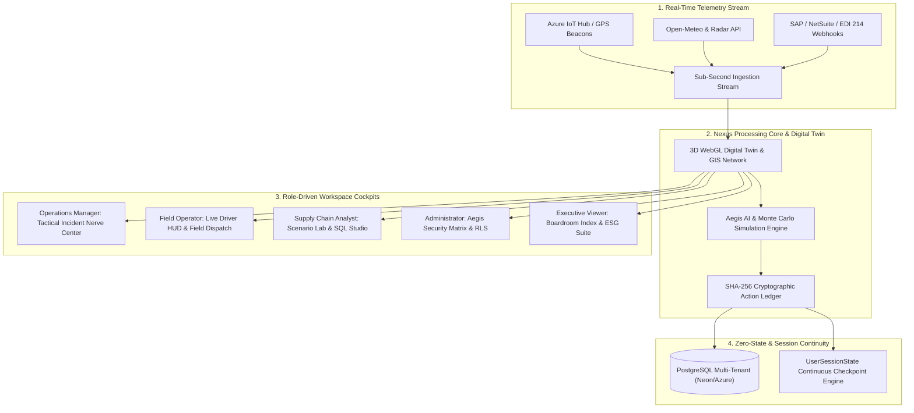

<div align="center">

# 🌐 NEXUS
### *Autonomous Logistics Operating System & Real-Time Digital Twin*

[-000000?style=for-the-badge&logo=nextdotjs&logoColor=white)](https://nextjs.org/)
[](https://fastapi.tiangolo.com/)
[](https://www.postgresql.org/)
[](https://threejs.org/)
[](https://www.typescriptlang.org/)
[](https://tailwindcss.com/)
[](LICENSE)

<br />

**[🚀 Live Production Web App](https://frontend-brown-seven-19.vercel.app)** · **[📖 Architecture Blueprint](docs/ROLE_DRIVEN_ARCHITECTURE_BLUEPRINT.md)** · **[⚡ API Docs (Swagger)](https://nexus-api-prod-adfjh5fvabd6cpgv.austriaeast-01.azurewebsites.net/docs)**

</div>

---

## ⚡ Executive Overview

Traditional logistics and fleet visibility platforms (e.g. Samsara, Project44, Flexport, Manhattan TMS) are **passive monitoring dashboards** — they notify teams *after* a driver is stuck in a blizzard or after an SLA breach has occurred, leaving operators to manually scramble across phone calls and spreadsheets.

**NEXUS is an Autonomous Logistics Operating System with a Real-Time Spatial Digital Twin and a Predictive Monte Carlo Decision Engine.**

Instead of reactive alerts, NEXUS **preempts disruptions before they happen**, continuously simulating dynamic weather hazards, fuel spikes, and depot chokepoints, then generating one-click cryptographic rerouting actions.

```
┌─────────────────────────────────────────────────────────────────────────────────────────┐
│                              THE NEXUS PARADIGM SHIFT                                   │
├────────────────────────────┬────────────────────────────────────────────────────────────┤
│ Traditional Fleet Software │ NEXUS Autonomous Digital Twin                              │
├────────────────────────────┼────────────────────────────────────────────────────────────┤
│ ❌ Reactive alert pings    │ ✅ Predictive preemption (AI simulates bottlenecks ahead)  │
│ ❌ Monolithic single view  │ ✅ 5 bespoke role cockpits tailored to exact workflows     │
│ ❌ Clunky legacy UI        │ ✅ Apple-grade tactile design (iOS grouped hierarchy,     │
│                            │    SF typography, subtle haptics & audio cues)             │
│ ❌ Manual rerouting calls  │ ✅ 1-Click Monte Carlo AI simulation + auto-rerouting      │
│ ❌ Slow transactional DB   │ ✅ Role-partitioned PostgreSQL materialized query layers  │
│ ❌ Hardcoded mock clutter  │ ✅ Clean zero-state by default + interactive sandbox mode  │
└────────────────────────────┴────────────────────────────────────────────────────────────┘
```

---

## 🏛️ System Architecture


```mermaid
flowchart TD
    subgraph IngestionLayer["1. Real-Time Telemetry Stream"]
        IoT["Azure IoT Hub / GPS Beacons"] --> EdgePipe["Sub-Second Ingestion Stream"]
        Weather["Open-Meteo & Radar API"] --> EdgePipe
        ERP["SAP / NetSuite / EDI 214 Webhooks"] --> EdgePipe
    end

    subgraph CoreEngine["2. Nexus Processing Core & Digital Twin"]
        EdgePipe --> SpatialTwin["3D WebGL Digital Twin & GIS Network"]
        SpatialTwin --> MonteCarlo["Aegis AI & Monte Carlo Simulation Engine"]
        MonteCarlo --> Ledger["SHA-256 Cryptographic Action Ledger"]
    end

    subgraph BespokeCockpits["3. Role-Driven Workspace Cockpits"]
        SpatialTwin --> Mgr["Operations Manager: Tactical Incident Nerve Center"]
        SpatialTwin --> Op["Field Operator: Live Driver HUD & Field Dispatch"]
        SpatialTwin --> An["Supply Chain Analyst: Scenario Lab & SQL Studio"]
        SpatialTwin --> Ad["Administrator: Aegis Security Matrix & RLS"]
        SpatialTwin --> Ex["Executive Viewer: Boardroom Index & ESG Suite"]
    end

    subgraph PersistenceLayer["4. Zero-State & Session Continuity"]
        Ledger --> Postgres[("PostgreSQL Multi-Tenant (Neon/Azure)")]
        Ledger --> Checkpoints["UserSessionState Continuous Checkpoint Engine"]
    end
```

---

## 👥 The 5 Role-Driven Cockpits

NEXUS discards the generic one-size-fits-all dashboard. Each organization role receives an entirely distinct, purpose-built cockpit designed for their cognitive load and responsibilities:

| Role Cockpit | Primary Objective | Key Widgets & Capabilities |
| :--- | :--- | :--- |
| **🚨 Operations Manager** | Clear chokepoints & minimize SLA penalties within 90s | • **SLA Breach Countdown Queue** ranked by liability ($\$$)<br />• **Split-Screen AI Resolver**: Baseline vs. Bypass delta<br />• **1-Click Reroute Authorization** dispatched to trucks |
| **🚚 Fleet Operator** | Driver shift safety & real-time dock turnarounds | • **High-Density Telemetry Stream** (Speed, Battery %, PSI, $-4.2^\circ\text{C}$ Temp)<br />• **Tactical Keyboard Hotkeys** (`[Space]` Acknowledge, `[D]` Dispatch)<br />• **1-Click Driver Voice Bridge** and SOS Emergency Broadcast |
| **🔬 Supply Chain Analyst** | Multi-variate what-if modeling & network economics | • **Monte Carlo Simulation Lab** ($1\text{k} - 10\text{k}$ stochastic runs)<br />• **Predictive Delay Distribution Histogram** & Risk confidence curve<br />• **Instant Dataset Export** to `.parquet`, `.csv`, and `.json` |
| **🛡️ System Administrator** | 99.99% uptime, data privacy & security governance | • **Data Pipeline Health Latency Monitor** (Azure IoT, Kafka, Redis)<br />• **Immutable Cryptographic Action Ledger** (SHA-256 hash chains)<br />• **FIDO2 / Passkey Hardware Enforcement** & Multi-tenant RLS |
| **📊 Executive Viewer** | Boardroom ROI visibility, margin preservation & ESG | • **Enterprise Macro KPI Suite** (Global OTD $98.4\%$, Net Savings $\$1.42\text{M}$)<br />• **Scope 1 & 3 ESG Carbon Avoidance Index** ($42.8\text{ Tons}$ avoided)<br />• **1-Click Executive PDF Briefing Generator** |

---

## 🔮 Next-Level Platform Innovations

```
┌──────────────────────────────────────────────────────────────────────────────────┐
│                             NEXT-LEVEL INNOVATIONS                               │
├──────────────────────────┬───────────────────────────────────────────────────────┤
│ 1. 4D Time-Travel        │ Scrub backward (-24h) to replay historical telemetry  │
│    Scrubber              │ or forward (+24h) to forecast weather & storm physics │
├──────────────────────────┼───────────────────────────────────────────────────────┤
│ 2. Multiplayer War Room  │ Live Figma-style cursor presence & shared interactive │
│                          │ incident co-triage canvas                             │
├──────────────────────────┼───────────────────────────────────────────────────────┤
│ 3. Driver Beacon Pass    │ 1-click QR / link generator for zero-install mobile   │
│                          │ driver PWA guidance with geo-verified PoD signature   │
├──────────────────────────┼───────────────────────────────────────────────────────┤
│ 4. Geofence Hazard       │ Spatial polygon drawer on 3D globe to paint dynamic   │
│    Painter               │ hazard perimeters and force automatic AI avoidance    │
├──────────────────────────┼───────────────────────────────────────────────────────┤
│ 5. Apple HIG Settings    │ Inset grouped cards, spring-animated toggles, tactile │
│    Experience            │ audio feedback, and role-scoped configuration panels  │
├──────────────────────────┼───────────────────────────────────────────────────────┤
│ 6. Default-to-Zero State │ Pristine clean zero-asset default for new workspaces  │
│    & Session Checkpoints │ with instant toggle to Interactive Sandbox Mode       │
└──────────────────────────┴───────────────────────────────────────────────────────┘
```

---

## 🛠️ Monorepo Structure

```
Nexus/
├── backend/                       # FastAPI High-Performance Backend
│   ├── app/
│   │   ├── api/v1/endpoints/      # REST API Endpoints (Vehicles, Warehouses, Sims)
│   │   ├── core/                  # Security, Passkeys, Rate Limiting & Config
│   │   ├── db/                    # Async SQLAlchemy & PostgreSQL Connection
│   │   ├── models/                # Database ORM Entity Models
│   │   ├── services/              # AI Synthesis, Cache, Task Queues & Telemetry
│   │   └── voice/                 # WebRTC / Voice AI Streaming Copilot
│   └── tests/                     # 35+ Comprehensive Pytest Test Suites
│
├── frontend/                      # Next.js 15 App Router Frontend
│   ├── app/
│   │   ├── (app)/overview/        # Main Command Center (Mounts 5 Cockpits)
│   │   ├── (app)/settings/        # iOS-Grade Apple HIG Grouped Settings
│   │   ├── (app)/simulations/     # Monte Carlo Scenario Builder
│   │   └── (app)/live-world/      # Spatial WebGL Digital Twin & DeckGL Network
│   ├── components/
│   │   ├── role-dashboards/       # Manager, Operator, Analyst, Admin & Viewer
│   │   ├── innovations/           # 4D Scrubber, Multiplayer, Driver Beacon & Hazard
│   │   ├── settings/              # AppleSettingsView Inset Hierarchy
│   │   ├── ui/                    # Tactile Glassmorphism Component Library
│   │   └── world/                 # Three.js 3D Globe & Spatial Canvas
│   ├── lib/                       # DataProvider, EventBus, Cache & Permissions
│   └── styles/                    # Tailwind CSS Design Tokens & SF Typography
│
├── database/                      # Prisma Schema & Database Migrations
│   └── prisma/schema.prisma       # Multi-tenant RLS & Telemetry Stream Models
│
└── docs/                          # Comprehensive Technical Documentation
    ├── ROLE_DRIVEN_ARCHITECTURE_BLUEPRINT.md
    ├── ARCHITECTURE.md
    └── API_SPECIFICATION.md
```

---

## 🚀 Quickstart & Local Development

### Prerequisites
- **Node.js**: `v20.x` or higher
- **Python**: `v3.11` or higher
- **PostgreSQL**: Local instance or Neon Cloud connection URL

### 1. Repository Setup
```bash
# Clone the repository
git clone https://github.com/AadityaUniyal/Nexus.git
cd Nexus
```

### 2. Frontend Development (Next.js 15)
```bash
cd frontend
npm install
npm run dev
# Open http://localhost:3000 in your browser
```

### 3. Backend Development (FastAPI)
```bash
cd backend
python -m venv venv

# Windows:
venv\Scripts\activate
# macOS/Linux:
source venv/bin/activate

pip install -r requirements.txt
uvicorn app.main:app --reload --port 8000
# API Docs available at http://localhost:8000/docs
```

### 4. Running Verification Test Suites
```bash
# Run backend test suite (35+ test cases)
python -m pytest backend/tests

# Run frontend TypeScript type verification
cd frontend && npx tsc --noEmit
```

---

## 🔐 Security & Governance

- **Biometric & Passkey Enclave**: FIDO2 / WebAuthn passwordless authentication with hardware-bound credentials.
- **Multi-Tenant Isolation**: Enforced PostgreSQL Row-Level Security (RLS) on all `workspace_id` queries.
- **Cryptographic Action Ledger**: Every automated AI decision and human override is hashed with SHA-256 and chained into an immutable audit trail.
- **Rate-Limiting**: Sliding-window token governor protecting against brute-force and DDoS vectors.

---

## 📄 License

This project is licensed under the MIT License — see the [LICENSE](LICENSE) file for details.
