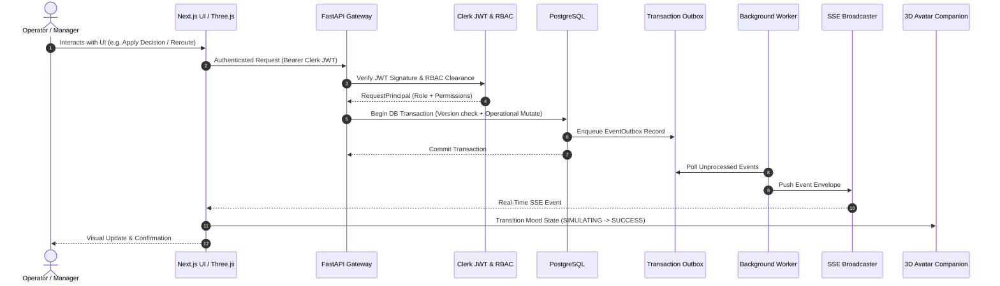

# NEXUS System Architecture Specification

This document provides a comprehensive technical breakdown of the NEXUS Operational Intelligence and Decision Simulation Platform.

---

## 1. Top-Level Directory Layout

The repository is organized into four core functional domains:

```
nexus/
├── frontend/        # Next.js 15 App Router, React 18, Clerk SDK, Motion, Three.js / R3F
├── backend/         # Python FastAPI, SQLAlchemy 2.0 Async, Pydantic v2, SSE Realtime
├── database/        # PostgreSQL schema, Prisma schema & seed migrations
├── tests/           # Unified automated test suites (Backend Pytest, Security, E2E)
├── docs/            # In-depth architectural, design system, and database documentation
├── LICENSE          # MIT Open Source License
└── README.md        # Single master repository overview & setup guide
```

---

## 2. Core Working Flow: No Fake Buttons

Every meaningful user action in NEXUS executes through an end-to-end deterministic lifecycle:



---

## 3. Module Responsibilities

### 1. `frontend/`
- **App Router (`frontend/app/`)**: 57 static and server-rendered routes covering public landing stories, marketing deep-dives, authentication, 5-step workspace onboarding, live operations (vehicles, warehouses, routes, orders), incident management, what-if simulations, and full administration.
- **Motion System (`frontend/components/motion/`)**: Tactile spring physics, 0.985 scale interactions, masked reveals, and `useReducedMotion` system compliance.
- **3D Spatial Systems (`frontend/components/world/` & `avatar/`)**:
  - `Avatar3D`: 9 emotional mood states with interactive cursor gaze tracking and spring physics.
  - `InteractiveWorldMap` / `NexusWorld`: Geospatial WebGL renderer visualizing real-time GPS splines, vehicles, and hub digital twins.

### 2. `backend/`
- **FastAPI Gateway (`backend/app/main.py`)**: Root routing, CORS middleware, rate limiting, request timing tracking (`X-Request-ID`), and standardized error formatting.
- **Auth & RBAC (`backend/app/auth/`)**: Salted bcrypt password verification, Clerk session token decoding, JWKS public key cache, Svix webhook signature verification, and 15-permission RBAC enforcement across 5 operator roles.
- **Deterministic Simulation Engine (`backend/app/services/simulation_engine.py`)**: Authoritative mathematical what-if calculation analyzing time saved, cost deltas, and SLA breach risks.
- **Transactional Outbox Worker (`backend/app/workers/worker.py`)**: Asynchronously processes queued outbox rows to generate user notifications and publish SSE events.

### 3. `database/`
- **Data Models**: Relational schemas for `workspaces`, `users`, `vehicles`, `warehouses`, `routes`, `orders`, `incidents`, `simulations`, `decisions`, `notifications`, `audit_logs`, `pipeline_health`, and `event_outbox`.
- **Optimistic Concurrency**: `version: int` columns on high-concurrency entities to reject stale state mutations.

### 4. `tests/`
- **Backend Tests (`tests/backend/`)**: 65 automated tests across 14 modules:
  - `test_auth_security.py` & `test_user_and_auth_lifecycle.py`: Bcrypt hashing, token lifecycle, 401 unauthenticated enforcement, and RBAC matrix.
  - `test_admin_and_governance.py`: Telemetry pipeline and administrative governance.
  - `test_incident_service.py`: Incident state transition rules (`DETECTED` -> `RESOLVED`).
  - `test_simulation_engine.py`: Deterministic rerouting and aerodynamic cost evaluation formulas.
  - `test_adversarial_challenge.py`: Boundary conditions, malformed payloads, and invalid transition handling.
  - `test_full_operational_vertical_slice.py`: End-to-end operational lifecycle integration.
  - `test_webhooks_and_concurrency.py`: Clerk webhook signature checks and idempotency.
