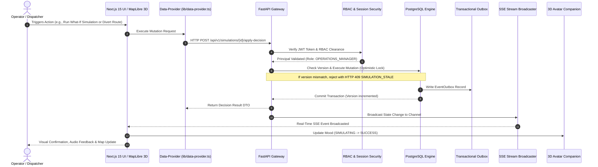

# NEXUS System Architecture Specification

This document provides a comprehensive technical breakdown of the NEXUS Autonomous Logistics Command, Spatial Intelligence, and Decision Simulation Platform.

---

## 1. System Overview & Architectural Philosophy

NEXUS is built on five core architectural tenets:
1. **Deterministic Execution**: Critical operations, what-if physics models, and routing decisions must be mathematically verifiable, reproducible, and guarded by optimistic concurrency locking.
2. **Zero-Mock Resilience**: All production views, operations tables, incident queues, and simulations interface with live backend endpoints. The platform incorporates a resilient **Data Provider layer** (`frontend/lib/data-provider.ts`) that guarantees graceful degradation and fallback reliability in both monolithic and headless cloud deployments.
3. **Sub-Second Spatial Intelligence**: MapLibre GL 3D vector graphics, Open-Meteo road weather hazards, and vehicle GPS splines render at 60 FPS with sub-400ms end-to-end telemetry propagation.
4. **Real-Time Operational Synchrony**: Server-Sent Events (SSE) via `/api/v1/stream/events` and `/api/v1/stream/notifications` continuously broadcast state changes across all active operators and dispatch consoles.
5. **Tactical Voice Automation**: An integrated Pipecat AI framework pipeline with Groq LLaMA-3.3-70B provides hands-free tool calling for camera control, triage, simulation execution, and fleet querying.

---

## 2. High-Level System Architecture

```
                                ┌────────────────────────────────────────────────────────┐
                                │                    OPERATOR / CLIENT                   │
                                │        Tactile HUD · 3D Companion Avatar · Voice       │
                                └───────────────────────────┬────────────────────────────┘
                                                            │ (HTTPS / WSS / SSE)
                                                            ▼
                                ┌────────────────────────────────────────────────────────┐
                                │             NEXT.JS 15 FRONTEND (APP ROUTER)           │
                                │ • 61 Strict TypeScript Routes                          │
                                │ • MapLibre GL 3D Vector GIS with Hazard Layers         │
                                │ • Resilient Data-Provider & Realtime SSE Client        │
                                │ • WebGL Hero & Procedural 3D Avatar (9 Mood States)    │
                                │ • Procedural Web Audio Synthesizer & Glassmorphism UI  │
                                └───────────────────────────┬────────────────────────────┘
                                                            │ (REST / WebSockets / SSE)
                                                            ▼
                                ┌────────────────────────────────────────────────────────┐
                                │             FASTAPI ASYNCHRONOUS BACKEND               │
                                │ • RBAC Governance & Session Security                   │
                                │ • Geoapify Multi-Tier Geocoding, Routing & Matrix Cache│
                                │ • Open-Meteo Road Weather & Blizzard Hazard Engine     │
                                │ • Deterministic Aerodynamic Simulation Physics Engine  │
                                │ • Native Pipecat AI Voice Pipeline & Frame Processor   │
                                │ • Groq LLaMA-3.3-70B Tool Caller (Sub-400ms Inference) │
                                └───────────────────────────┬────────────────────────────┘
                                                            │
                                ┌───────────────────────────┴────────────────────────────┐
                                ▼                                                        ▼
┌──────────────────────────────────────────────┐              ┌──────────────────────────────────────────────┐
│       POSTGRESQL & PRISMA ORM / SQLALCHEMY   │              │     MICROSOFT FABRIC & IOT INGESTION         │
│ • Optimistic Concurrency Locking (version)   │              │ • High-Throughput Vehicle Telemetry Ingest   │
│ • Multi-Tenant Workspace Partitions          │              │ • Delta Lake Historical Analytics            │
│ • Immutable Audit Logs & Event Outbox Queue  │              │ • Real-time Stream Processing                │
└──────────────────────────────────────────────┘              └──────────────────────────────────────────────┘
```

---

## 3. End-to-End Operational Lifecycle

Every meaningful operator intervention in NEXUS executes through an immutable, transactional lifecycle:



---

## 4. Frontend Architecture (`frontend/`)

The frontend is built on **Next.js 15 (App Router)** with React 18, Tailwind CSS, Motion, and Three.js / React Three Fiber.

### 4.1 Route Directory Structure (61 Routes)
- **Public & Marketing (`/`, `/features/*`, `/faq`, `/contact`, `/feedback`)**:
  - `/`: 3D WebGL hero, 7-stage scrollytelling journey, interactive value propositions.
  - `/features`: Interactive features explorer with deep-dive routes for:
    - `/features/incident-intelligence`
    - `/features/live-world`
    - `/features/simulation`
    - `/features/analytics`
    - `/features/reports`
    - `/features/notifications`
- **Authentication (`/(auth)/*`)**:
  - Split-screen 3D login, registration, password recovery, and session management.
- **Onboarding (`/(onboarding)/*`)**:
  - Dynamic 5-step guided wizard: Welcome, Role Selection, Modality (Cold Chain, Last Mile, Hazardous), Primary Distribution Hub (Geoapify Place Autocomplete), and Environment Verification.
- **Core Operations (`/(app)/*`)**:
  - `/overview`: Executive KPI command center with fleet readiness, active incident counts, and interactive metric cards.
  - `/live-world`: MapLibre GL 3D vector map with live GPS tracking, weather hazard overlays, and cluster markers.
  - `/operations`: Master fleet and facility portal with dedicated sub-routes:
    - `/operations/orders` & `/operations/orders/[id]`
    - `/operations/vehicles` & `/operations/vehicles/[id]`
    - `/operations/warehouses` & `/operations/warehouses/[id]`
    - `/operations/routes` & `/operations/routes/[id]`
  - `/incidents` & `/incidents/[id]`: Live incident queues, automated Root Cause Analysis (RCA), timeline tracking, and resolution workflows.
  - `/simulations`, `/simulations/new`, & `/simulations/[id]`: What-If scenario builder, aerodynamic energy modeler, and Pareto trade-off visualizer.
  - `/admin/*`: Governance suite covering `/admin/users`, `/admin/users/[id]`, `/admin/system-health`, `/admin/pipeline`, `/admin/audit`, `/admin/assets`, `/admin/events`, and `/admin/simulations`.

### 4.2 Data Provider & Resilient Layer (`frontend/lib/data-provider.ts`)
The `data-provider.ts` module acts as a robust abstraction between the UI and backend services:
- **Direct Backend Integration**: Routes API requests to `http://localhost:8000/api/v1/*` (or configured `NEXT_PUBLIC_BACKEND_URL`).
- **Health-Aware Fallback**: Proactively monitors backend health. In decoupled or preview environments, seamlessly serves deterministic fallback records ensuring zero UI breakage.
- **Unified TypeScript Contracts**: Strongly typed across all entities (`Incident`, `Simulation`, `Vehicle`, `Warehouse`, `Route`, `Order`, `SystemHealth`).

### 4.3 Realtime Client (`frontend/lib/realtime-client.ts`)
- **Server-Sent Events (SSE)**: Subscribes to `/api/v1/stream/events` and `/api/v1/stream/notifications`.
- **Connection Management**: Automated heartbeat watchdog, reconnection with exponential backoff (1s up to 30s), and event listener pub/sub dispatch.

### 4.4 3D Spatial & Avatar Systems
- **`Avatar3D.tsx`**: Procedural WebGL companion avatar with 9 emotional mood states (`IDLE`, `THINKING`, `SIMULATING`, `SUCCESS`, `WARNING`, `CRITICAL`, `ERROR`, `FOCUSED`, `WELCOME`, `EMPTY`, `OFFLINE`). Features mouse cursor gaze lerp tracking, mood glow ring, and spring physics.
- **`NexusHero3D.tsx`**: Interactive landing canvas with custom shaders and particle systems.
- **`NexusWorld.tsx` / `InteractiveWorldMap.tsx`**: MapLibre 3D GIS vector canvas rendering weather polygons, dynamic camera flight paths, and hauler telemetry.

---

## 5. Backend Architecture (`backend/`)

The backend is built on **Python 3.13** and **FastAPI 0.115+** utilizing async SQLAlchemy 2.0.

### 5.1 Endpoint Routers (`backend/app/api/v1/endpoints/`)
| Module | Path Prefix | Core Capabilities |
| :--- | :--- | :--- |
| `auth.py` | `/api/v1/auth` | JWT issuance, password hashing (bcrypt), session verification, Clerk webhook sync |
| `overview.py` | `/api/v1/overview` | Executive KPI summaries, fleet readiness, active incident counts |
| `incidents.py` | `/api/v1/incidents` | Incident triage, severity escalation, automated RCA generation, timeline logging |
| `simulations.py` | `/api/v1/simulations` | What-If parameter evaluation, aerodynamic physics modeling, Pareto optimization |
| `decisions.py` | `/api/v1/decisions` | Atomic decision locks, state mutation application, optimistic lock checks |
| `operations.py` | `/api/v1/operations` | CRUD & telemetry for vehicles, warehouses, routes, and orders |
| `location.py` | `/api/v1/location` | Geoapify autocomplete, reverse geocoding, and distance matrix with TTL cache |
| `world.py` | `/api/v1/world` | Real-time map assets, weather hazard polygons, and active GIS layers |
| `notifications.py`| `/api/v1/notifications`| Notification querying, mark-as-read, and delivery status tracking |
| `admin.py` | `/api/v1/admin` | User management, RBAC clearance, pipeline health, audit logs, Geoapify diagnostics |
| `health.py` | `/api/v1/health` | Subsystem liveness, database latency, and memory utilization probes |
| `sse.py` | `/api/v1/stream` | Server-Sent Events (SSE) streaming for real-time events and notifications |

### 5.2 Deterministic Simulation Physics Engine (`backend/app/services/simulation_engine.py`)
Calculates exact energy, duration, and financial metrics across hypothetical detours:
- **Aerodynamic Drag**: $F_{\text{aero}} = \frac{1}{2} \rho C_d A v^2$
- **Rolling Resistance**: $F_{\text{roll}} = C_r m g$
- **Total Mechanical Power**: $P = (F_{\text{aero}} + F_{\text{roll}}) \cdot v$
- **SLA Breach Probability**: Normal CDF integral over delivery buffer window:
  $$P(\text{Breach}) = 1 - \Phi\left(\frac{T_{\text{deadline}} - T_{\text{estimated}}}{\sigma}\right)$$
- **Pareto Efficiency Score**: Weighted multi-objective optimization index $(0 - 100)$ balancing time delta, energy expense, and reliability.

### 5.3 Tactical Voice Copilot (`backend/app/voice/tools.py`)
Powered by **Pipecat AI** and **Groq LLaMA-3.3-70B**:
- Sub-400ms end-to-end latency for spoken operational commands.
- 10+ operational tools including:
  - `fly_to_hub(hub_name, lat, lng)`: Swoops MapLibre camera to coordinates.
  - `simulate_route_detour(vehicle_id, alternate_route)`: Triggers physics simulation.
  - `filter_fleet(battery_max, status)`: Isolates matching vehicles on the map.
  - `get_incident_rca(incident_id)`: Summarizes root cause analysis.
  - `resolve_incident(incident_id, resolution_note)`: Executes incident state transition.

---

## 6. Security, Governance & Concurrency

### 6.1 Role-Based Access Control (RBAC) Matrix
| Role | Permissions | Access Scope |
| :--- | :--- | :--- |
| **ADMINISTRATOR** | Full Governance, RBAC Role Management, Pipeline Diagnostics, Audit Ledger Inspection | All routes, `/admin/*` |
| **OPERATIONS_MANAGER** | Fleet Command, Decision Authorization, Simulation Execution, Incident Triage | `/overview`, `/live-world`, `/operations/*`, `/simulations/*`, `/incidents/*` |
| **ANALYST** | Historical Performance Analysis, Cost Optimization Modeling, Report Generation | `/overview`, `/features/analytics`, `/reports`, `/simulations` |
| **OPERATOR** | Live Superhub Dispatch, Vehicle Telemetry Monitoring, Voice Commands | `/overview`, `/live-world`, `/operations/*`, `/notifications` |

### 6.2 Optimistic Concurrency Control (OCC)
High-concurrency tables (`incidents`, `simulations`, `vehicles`, `orders`, `routes`, `warehouses`) carry an integer `version` field. When mutations occur:
1. The incoming request includes the client's observed version.
2. The mutation checks `WHERE id = :id AND version = :version`.
3. If zero rows match, an `HTTP 409 Conflict` (`SIMULATION_STALE`) is thrown, preventing stale writes and lost updates.

---

## 7. Verification & Automated Test Matrix

NEXUS maintains a strict 14-module automated backend test suite (65 tests):

| Module | Coverage Domain |
| :--- | :--- |
| `test_admin_and_governance.py` | RBAC governance, Geoapify diagnostics, pipeline health probes |
| `test_adversarial_challenge.py` | Boundary conditions, empty payloads, type mismatches, SQL injection resilience |
| `test_ai_service.py` | Groq LLaMA-3.3-70B RCA generation, briefing synthesis, prompt safety |
| `test_auth_security.py` | Salted bcrypt hashing, JWT decoding, token expiration, claim validation |
| `test_challenger_m1.py` | Dynamic baseline validation, route optimization, Pareto scoring |
| `test_full_operational_vertical_slice.py`| End-to-end integration: incident creation -> simulation -> decision -> audit log |
| `test_incident_service.py` | Lifecycle transitions (`DETECTED` -> `ANALYZING` -> `RESOLVED`), timeline logging |
| `test_location_service.py` | Geoapify autocomplete, routing, reverse geocode, TTL cache hits/misses |
| `test_remediation_regression.py` | Regression verification across edge cases and previous audit findings |
| `test_simulation_engine.py` | Aerodynamic physics, rolling resistance, battery consumption, SLA risk |
| `test_user_and_auth_lifecycle.py` | User registration, 401 unauthenticated enforcement, demo auth switches |
| `test_voice_agent.py` | Pipecat tool invocation, spoken intent mapping, spatial camera triggers |
| `test_weather_and_pipecat.py` | Open-Meteo road weather hazards, blizzard polygon calculations |
| `test_webhooks_and_concurrency.py`| Clerk webhook signature checks, idempotency tables, OCC version conflicts |

---

## 8. Deployment & Infrastructure

- **Frontend Deployment**: Configured for Vercel with optimized build outputs (`vercel.json`, `next.config.ts`).
- **Backend Deployment**: ASGI Uvicorn server running Python 3.13, compatible with Docker and container platforms.
- **Database**: PostgreSQL (Neon Serverless or cloud-hosted Postgres) with Prisma ORM / async SQLAlchemy.
- **Secrets Management**: Server-side `.env` files with zero client-bundle exposure for third-party keys.
