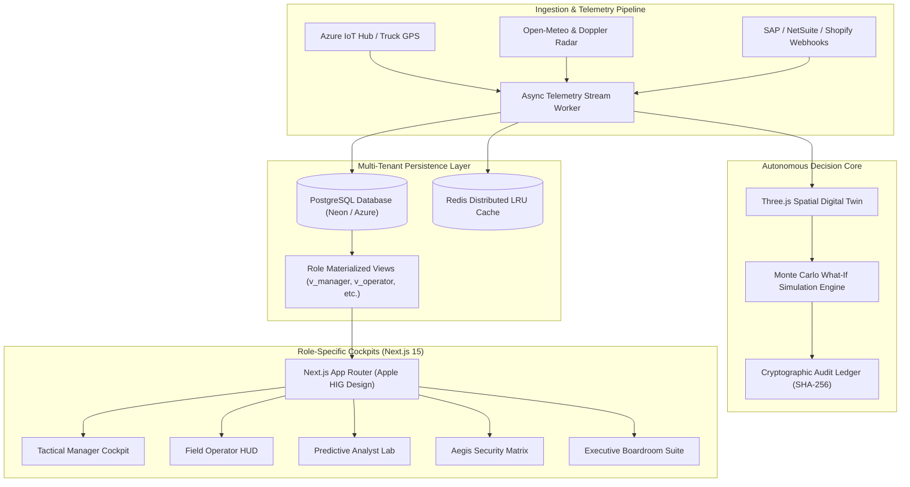

# 🏛️ NEXUS System Architecture & Technical Specifications

---

## 1. Architectural Philosophy

NEXUS is engineered as an **Autonomous Logistics Operating System** that unifies real-time IoT spatial telemetry, physics-based simulations, and role-scoped operational cockpits into a single coherent reactive platform.


```mermaid
graph TD
    subgraph DataIngest["Ingestion & Telemetry Pipeline"]
        GPS["Azure IoT Hub / Truck GPS"] --> StreamWorker["Async Telemetry Stream Worker"]
        Weather["Open-Meteo & Doppler Radar"] --> StreamWorker
        ERP["SAP / NetSuite / Shopify Webhooks"] --> StreamWorker
    end

    subgraph StorageLayer["Multi-Tenant Persistence Layer"]
        StreamWorker --> Postgres[("PostgreSQL Database (Neon / Azure)")]
        StreamWorker --> Redis[("Redis Distributed LRU Cache")]
        Postgres --> Views["Role Materialized Views (v_manager, v_operator, etc.)"]
    end

    subgraph DecisionEngine["Autonomous Decision Core"]
        StreamWorker --> DigitalTwin["Three.js Spatial Digital Twin"]
        DigitalTwin --> MonteCarlo["Monte Carlo What-If Simulation Engine"]
        MonteCarlo --> Ledger["Cryptographic Audit Ledger (SHA-256)"]
    end

    subgraph ClientLayer["Role-Specific Cockpits (Next.js 15)"]
        Views --> NextApp["Next.js App Router (Apple HIG Design)"]
        NextApp --> Mgr["Tactical Manager Cockpit"]
        NextApp --> Op["Field Operator HUD"]
        NextApp --> An["Predictive Analyst Lab"]
        NextApp --> Ad["Aegis Security Matrix"]
        NextApp --> Ex["Executive Boardroom Suite"]
    end
```

---

## 2. Multi-Tier Technology Stack

### 2.1 Frontend Client (Next.js 15 App Router)
- **Framework**: Next.js 15 (React 18, React Server Components + Client Islands).
- **Styling & Tokens**: Tailwind CSS v3 with custom Apple Human Interface Guidelines (HIG) glassmorphism and tactile elevation tokens.
- **Motion & Physics**: Framer Motion with spring physics (`cubic-bezier(0.16, 1, 0.3, 1)`).
- **Spatial Rendering**: Three.js WebGL 3D Globe with DeckGL / Leaflet 2D GIS vector fallback.
- **Audio & Haptics**: Web Audio API tactile feedback synthesizer (`lib/sound-effects.ts`).

### 2.2 Backend Application (FastAPI)
- **Runtime**: Python 3.11+ ASGI asynchronous web server.
- **Framework**: FastAPI with Pydantic v2 data serialization.
- **Database Access**: SQLAlchemy Async ORM with connection pooling and circuit breakers.
- **Task Scheduling & Ingestion**: Celery / Redis asynchronous worker queue with dead-letter queue (DLQ) support.
- **Voice & Copilot**: WebRTC / WebSocket streaming bridge with low-latency LLM synthesis.

### 2.3 Database & Query Architecture (PostgreSQL)
- **Multi-Tenancy**: Workspace-level tenant partitioning enforced via PostgreSQL Row-Level Security (RLS).
- **Telemetry Hypertables**: Sub-second GPS telemetry partitioned by `workspace_id` and `recordedAt`.
- **Pre-Computed Materialized Views**:
  - `v_manager_incident_cockpit`: Sub-5ms aggregation of active high-severity SLA liabilities.
  - `v_operator_live_fleet`: Geospatial bounding-box indexed view for 60fps vector rendering.
  - `v_analyst_corridor_efficiency`: 30-day historical corridor delay and weather regressions.
  - `v_executive_macro_kpis`: Hourly snapshot rollups of On-Time Delivery and ESG carbon savings.

---

## 3. The 5 Bespoke Role Workflows

```
┌──────────────────────────────┬─────────────────────────────────────────────────────────────┐
│ Role Type                    │ Operational Mental Model & Cockpit Objective                │
├──────────────────────────────┼─────────────────────────────────────────────────────────────┤
│ 1. OPERATIONS_MANAGER        │ Triage SLA breach countdown queue, inspect AI mitigation    │
│                              │ baseline vs. bypass delta, execute 1-click fleet reroute.   │
├──────────────────────────────┼─────────────────────────────────────────────────────────────┤
│ 2. OPERATOR                  │ High-density live telemetry stream (Speed, Battery %, PSI,  │
│                              │ Temp), driver radio bridge, dock turnarounds, SOS dispatch. │
├──────────────────────────────┼─────────────────────────────────────────────────────────────┤
│ 3. ANALYST                   │ Multi-variate Monte Carlo simulations (1k-10k runs), risk   │
│                              │ distribution histograms, carrier regression, data exports.  │
├──────────────────────────────┼─────────────────────────────────────────────────────────────┤
│ 4. ADMINISTRATOR             │ Pipeline latency monitors (IoT, Kafka, Redis), FIDO2        │
│                              │ passkeys, multi-tenant RBAC, SHA-256 audit ledger.          │
├──────────────────────────────┼─────────────────────────────────────────────────────────────┤
│ 5. VIEWER                    │ Boardroom ROI visibility, Scope 1 & 3 ESG carbon avoidance, │
│                              │ 1-click executive PDF briefing generation.                  │
└──────────────────────────────┴─────────────────────────────────────────────────────────────┘
```

---

## 4. Zero-State & Session Checkpointing Flow

1. **New User Registration**: Workspace initializes with clean **0-asset state** (0 vehicles, 0 incidents, 0 delayed orders).
2. **Onboarding Guidance**: Empty state cards provide 1-click launchpad to `[Import CSV Fleet]` or toggle `[Interactive Sandbox Mode]` to test simulated emergencies without writing to production tables.
3. **Session Checkpoint Engine**: As the user modifies viewport zoom, adjusts simulation variables, or applies route filters, the client asynchronously checkpoints state into `UserSessionState` in PostgreSQL, enabling 100% instant resume across browsers and devices.

---

## 5. Security & Cryptographic Audit Ledger

Every automated decision proposed by the neural engine and every override signed by a human operator is cryptographically recorded:

$$\text{Block}_{n} = \text{SHA-256}\Big(\text{Block}_{n-1}\text{.hash} \parallel \text{Timestamp} \parallel \text{ActorID} \parallel \text{ActionType} \parallel \text{StateDeltaJSON}\Big)$$

This immutable audit chain ensures complete regulatory compliance, carrier dispute resolution, and verifiable ESG carbon audit trails.
