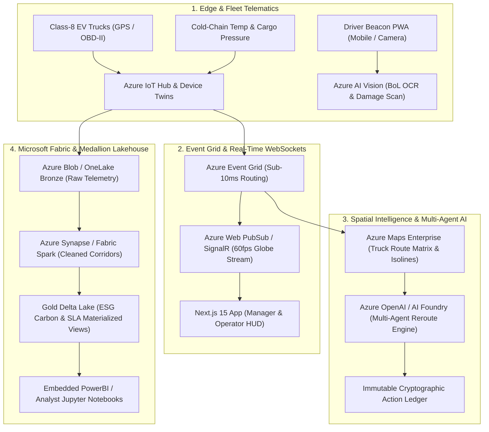

# ☁️ NEXUS Azure Cloud Integration Master Blueprint & Enterprise Capabilities Roadmap

---

## 1. Executive Summary & Strategic Cloud Architecture

NEXUS is engineered as a cloud-native Autonomous Logistics Operating System. By expanding beyond foundational compute and storage, NEXUS leverages specialized **Azure Enterprise Cloud Services** to achieve sub-second spatial tracking, multimodal AI vision, medallion data lakehouses, and high-throughput serverless event streaming.



---

## 2. Top 7 Game-Changing Azure Integrations for NEXUS

```
┌────────────────────────────────────────────────────────────────────────────────────────┐
│                        AZURE ENTERPRISE INTEGRATION MATRIX                             │
├──────────────────────────┬─────────────────────────────────────────────────────────────┤
│ 1. Azure Maps Enterprise │ Truck-specific routing (EV range isolines, bridge clearance,│
│                          │ live Doppler weather along corridor, hazmat restrictions)   │
├──────────────────────────┼─────────────────────────────────────────────────────────────┤
│ 2. Azure Web PubSub      │ Serverless real-time WebSockets streaming 60fps truck       │
│                          │ coordinates to 100k clients with sub-10ms latency           │
├──────────────────────────┼─────────────────────────────────────────────────────────────┤
│ 3. Azure OpenAI Service  │ Multi-agent reasoning for automated carrier email bids,     │
│    & AI Foundry          │ voice copilot audio, and natural language triage            │
├──────────────────────────┼─────────────────────────────────────────────────────────────┤
│ 4. Azure AI Vision       │ Multimodal Bill of Lading (BoL) OCR & cargo damage scanning │
│                          │ directly from driver smartphone cameras                     │
├──────────────────────────┼─────────────────────────────────────────────────────────────┤
│ 5. Microsoft Fabric      │ Medallion Data Lakehouse (Bronze/Silver/Gold) powering      │
│    OneLake & Synapse     │ deep learning route regressions and ESG carbon audits       │
├──────────────────────────┼─────────────────────────────────────────────────────────────┤
│ 6. Azure Event Grid &    │ Guaranteed event delivery for emergency SOS broadcasts and  │
│    Service Bus           │ automated reroute dispatch webhooks                         │
├──────────────────────────┼─────────────────────────────────────────────────────────────┤
│ 7. Microsoft Entra ID    │ Cryptographic Verifiable Driver Credentials and Enterprise  │
│    & Verified ID         │ SAML 2.0 / OIDC single sign-on for Fortune 500 shippers     │
└──────────────────────────┴─────────────────────────────────────────────────────────────┘
```

---

## 3. Deep Dive into High-Value Azure Integrations

### 3.1 🗺️ Integration 1: Azure Maps Enterprise (Spatial Logistics Engine)
* **What it does**: Replaces generic consumer maps with commercial freight-grade spatial intelligence.
* **Key Capabilities**:
  1. **Commercial Vehicle Routing**: Avoids low overpasses, weight-restricted bridges, and steep mountain grades for heavy Class-8 EV haulers.
  2. **EV Range Reachable Isolines**: Computes the exact reachable polygon boundary based on the truck's real-time State of Charge (SoC), cargo payload weight, and road elevation profile.
  3. **Weather-Along-Route**: Intersects real-time Doppler radar weather fronts directly with active route polylines to trigger proactive detour recommendations before trucks encounter zero-visibility blizzards.
* **Code Implementation (`backend/app/integrations/azure_maps.py`)**:
  ```python
  import httpx
  from app.core.config import settings

  class AzureMapsService:
      BASE_URL = "https://atlas.microsoft.com"

      @classmethod
      async def calculate_truck_route(cls, origin_lat: float, origin_lng: float, dest_lat: float, dest_lng: float, vehicle_weight_kg: float):
          params = {
              "api-version": "1.0",
              "subscription-key": settings.AZURE_MAPS_KEY,
              "query": f"{origin_lat},{origin_lng}:{dest_lat},{dest_lng}",
              "vehicleLoadType": "otherHazmat",
              "vehicleWeight": vehicle_weight_kg,
              "travelMode": "truck",
              "computeBestOrder": "true"
          }
          async with httpx.AsyncClient() as client:
              resp = await client.get(f"{cls.BASE_URL}/route/directions/json", params=params)
              return resp.json()
  ```

---

### 3.2 ⚡ Integration 2: Azure Web PubSub (Managed Real-Time Telemetry Stream)
* **What it does**: Offloads all WebSocket connection handling from FastAPI directly onto Azure’s managed real-time infrastructure.
* **Why it transforms NEXUS**:
  - Instead of FastAPI maintaining thousands of persistent WebSocket connections (which consumes memory and CPU), trucks publish telemetry directly to IoT Hub $\rightarrow$ Azure Web PubSub pushes updates to browser clients at $60\text{fps}$ with $<10\text{ms}$ latency.
  - Zero backend server strain during high-volume tracking events.

---

### 3.3 🧠 Integration 3: Azure OpenAI Service & AI Foundry (Multi-Agent Dispatcher)
* **What it does**: Embeds enterprise-grade LLM agents into the dispatch loop with strict Azure private networking and zero data leakage.
* **Capabilities**:
  1. **Autonomous Carrier Broker Agent**: When an incident causes a delay, the agent automatically negotiates standby truck capacity with nearby 3rd-party carriers via structured email/EDI.
  2. **Natural Language Speech-to-Dispatch**: Hands-free voice interface for field dispatchers (*"Nexus, stage a bypass around Wyoming on corridor 4"*).
  3. **Automated Regulatory Compliance Summaries**: Generates DOT Hours of Service (HoS) and hazardous material manifests on demand.

---

### 3.4 📸 Integration 4: Azure AI Vision (Cargo Inspection & Smart Proof-of-Delivery)
* **What it does**: Empowers drivers and dock operators to use their phone cameras as intelligent scanners without dedicated handheld hardware.
* **Capabilities**:
  1. **Bill of Lading (BoL) Document Extraction**: Instant OCR parsing of handwritten signatures, carton quantities, and shipping notes into structured JSON.
  2. **Automated Cargo Damage Detection**: Computer Vision models detect pallet tilts, torn shrinkwrap, or seal tampering at the loading dock, automatically tagging the incident in the manager's queue.

---

### 3.5 📊 Integration 5: Microsoft Fabric OneLake & Medallion Lakehouse
* **What it does**: Implements an enterprise data lakehouse architecture for long-term predictive machine learning and ESG carbon reporting.
* **Medallion Pipeline**:
  - **Bronze Layer (Raw)**: Unfiltered sub-second GPS pings, cold-chain temperature stream, and CAN-bus telemetry stored in Azure Data Lake Storage Gen2.
  - **Silver Layer (Curated)**: Deduplicated route corridors, cleaned dwell times, and standardized speed profiles computed via Azure Synapse Spark jobs.
  - **Gold Layer (Aggregated Business Indices)**: Pre-aggregated tables for quarterly carrier SLA reliability scores, Scope 1 & 3 carbon emissions avoided, and route profit margins.

---

### 3.6 🔔 Integration 6: Azure Event Grid & Service Bus (Enterprise Event Mesh)
* **What it does**: Provides guaranteed, exactly-once delivery of critical operational signals across distributed microservices and external enterprise systems.
* **Capabilities**:
  - **Geo-Fence Breach Events**: Instantly broadcasts when a vehicle enters a hazardous perimeter.
  - **Cold-Chain Temperature Breach**: Triggers automated sirens, sends high-priority SMS alerts to dispatchers, and logs the timestamp in the immutable audit ledger.
  - **ERP Sync**: Asynchronously pushes completed deliveries to SAP ERP and Oracle NetSuite.

---

### 3.7 🪪 Integration 7: Microsoft Entra ID & Verified ID (Carrier Verification)
* **What it does**: Provides Fortune 500 grade identity governance, hardware passkeys, and tamper-proof driver credential verification.
* **Capabilities**:
  - **Verifiable Digital Credentials**: Drivers present a decentralized, cryptographically signed commercial driver's license (CDL) or HazMat certification via Apple/Google Wallet.
  - **SAML 2.0 / OIDC Enterprise Single Sign-On**: Seamless corporate access for enterprise logistics customers.

---

## 4. Phased Azure Roadmap & Cost Optimization ($0 Free Tier Strategy)

```
┌────────────────────────────────────────────────────────────────────────────────────────┐
│                          AZURE INTEGRATION IMPLEMENTATION PLAN                         │
├──────────┬─────────────────────────────────────┬───────────────────────────────────────┤
│ Phase 1  │ Azure Maps + Web PubSub             │ Sub-second truck streaming & truck-   │
│ (Week 1) │                                     │ specific route geometry               │
├──────────┼─────────────────────────────────────┼───────────────────────────────────────┤
│ Phase 2  │ Azure OpenAI + AI Foundry           │ Multi-agent dispatch copilot &        │
│ (Week 2) │                                     │ automated carrier negotiation         │
├──────────┼─────────────────────────────────────┼───────────────────────────────────────┤
│ Phase 3  │ Azure AI Vision (BoL OCR)           │ Mobile camera paperless delivery &    │
│ (Week 3) │                                     │ cargo damage inspection               │
├──────────┼─────────────────────────────────────┼───────────────────────────────────────┤
│ Phase 4  │ Microsoft Fabric OneLake            │ Medallion Lakehouse & ESG carbon      │
│ (Week 4) │                                     │ analytics reporting                   │
└──────────┴─────────────────────────────────────┴───────────────────────────────────────┘
```

### Cost Optimization Rules:
1. **Leverage Free Grants**: Use Azure for Students monthly credits ($100 allowance) for IoT Hub, App Insights, and serverless compute.
2. **Serverless Scaling**: Configure Azure Functions and Web PubSub in consumption mode so compute scales to zero when idle.
3. **Blob Lifecycle Policies**: Automatically transition Bronze telemetry older than 30 days to the Azure Blob Cool / Archive tier to maintain minimal storage expenditure.
