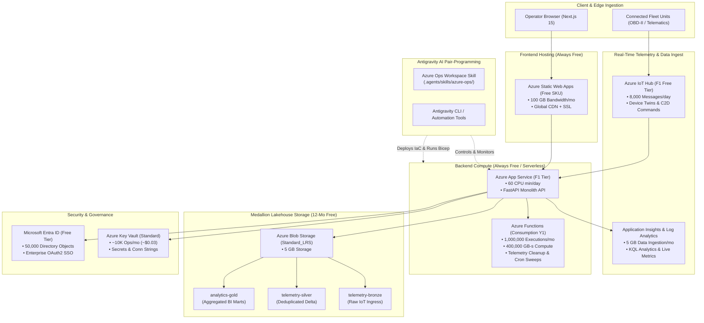

# 🌐 NEXUS Azure Free Tier & Cloud Analytics Architecture Blueprint

This document details the complete end-to-end integration of **NEXUS** with **Microsoft Azure Free Tier Services**, how to leverage Azure's free analytics powerhouses for spatial logistics intelligence, and how to seamlessly manage and operate everything directly within **Antigravity**.

---

## 🏛️ System Architecture Overview



---

## 💎 Free Tier Services Matrix & Alignment with NEXUS

| Azure Service | Free Tier SKU / Allocation | Role in NEXUS | Operational Limits & Optimization |
| :--- | :--- | :--- | :--- |
| **Azure Static Web Apps** | **Free SKU** (Always Free) | Hosts the Next.js 15 App Router Frontend | • 100 GB egress/month<br/>• Built-in CI/CD via GitHub Actions |
| **Azure App Service** | **F1 Tier** (Always Free) | Hosts FastAPI asynchronous REST / SSE Backend | • 60 CPU min/day, 1 GB RAM<br/>• Ideal for demo & dev staging |
| **Azure IoT Hub** | **F1 Tier** (Always Free) | Commercial fleet telemetry ingress & Cloud-to-Device (C2D) reroutes | • 8,000 messages/day<br/>• 1 Free hub per subscription |
| **Application Insights & Log Analytics** | **Free Tier** (Always Free) | APM, distributed tracing, request latency, and KQL analytics | • 5 GB ingestion/month<br/>• 90-day retention |
| **Azure Functions** | **Consumption (Y1)** (Always Free) | Background scheduled jobs (anomaly sweeps, SLA digests, archiving) | • 1M executions/month<br/>• 400,000 GB-seconds compute |
| **Azure Blob Storage** | **Standard_LRS** (12-Month Free) | Medallion Lakehouse (`bronze`, `silver`, `gold`) telemetry archives | • 5 GB LRS storage<br/>• 20,000 read/write operations |
| **Azure Key Vault** | **Standard** (Pay-per-op) | High-security vault for API keys, DB credentials, and secrets | • ~$0.03 per 10,000 operations (effectively free) |
| **Microsoft Entra ID** | **Free Tier** (Always Free) | Enterprise SSO / B2B OAuth2 user authentication | • Up to 50,000 directory objects |
| **Azure SQL Database** *(Optional)* | **Free Tier** (Always Free) | Relational operational data store alternative | • 100,000 vCore seconds/month<br/>• 32 GB storage (auto-pauses) |

---

## 📊 Analytics Powerhouses Available in Free Tier

### 1. KQL (Kusto Query Language) in Application Insights
Using Application Insights (5 GB free ingestion/month), you can query request traces, failure rates, and custom telemetry events with high-performance KQL:
```kql
// Real-time Fleet Telemetry Anomaly Detection Query in Azure Log Analytics
customEvents
| where name == "request_error" or name == "INCIDENT_DETECTED"
| extend VehicleId = tostring(customDimensions.vehicle_id)
| summarize IncidentCount = count() by bin(timestamp, 15m), VehicleId
| order by timestamp desc
```

### 2. Medallion Lakehouse on Azure Blob Storage
Telemetry data is partitioned and structured into 3 analytical tiers:
- **Bronze (`telemetry-bronze`)**: Raw JSON telemetry payload packets straight from Azure IoT Hub.
- **Silver (`telemetry-silver`)**: Cleaned, schema-enforced, and geocoded vehicle trajectory states.
- **Gold (`analytics-gold`)**: Pre-aggregated hourly KPIs, SLA adherence summaries, and driver risk scores.

### 3. Machine Learning & Predictive Analytics Engine
Integrated within `backend/app/services/analytics_service.py`:
- **IsolationForest Anomaly Detection**: Unsupervised multi-variate outlier detection over vehicle speed, battery discharge delta, and engine temperature.
- **Bayesian Time-Series Forecaster**: P10 / P50 / P90 confidence intervals for delivery demand and SLA risk.

---

## 🤖 Direct Connection with Antigravity

Antigravity seamlessly interfaces with your Azure environment via:

1. **Workspace Skill (`.agents/skills/azure-ops/SKILL.md`)**:
   - Gives Antigravity instant awareness of your Azure infrastructure, free-tier quotas, KQL queries, and cost-optimization playbooks.
2. **Infrastructure as Code (IaC) Automation**:
   - Run deployment templates directly with `az deployment group create` using `infra/bicep/main.bicep`.
3. **Automated Scripts**:
   - Deployment automation via `infra/scripts/deploy-free-tier.ps1`.
   - Secret orchestration via `infra/scripts/setup-keyvault-secrets.ps1`.

---

## 🚀 Step-by-Step Setup Guide

### Step 1: Log in and Provision Infrastructure
```powershell
# In PowerShell (run from project root)
az login

# Deploy all free tier resources
.\infra\scripts\deploy-free-tier.ps1 -Location "eastus"
```

### Step 2: Store Secrets into Key Vault
```powershell
# Automatically reads .env and pushes secrets securely to Key Vault
.\infra\scripts\setup-keyvault-secrets.ps1 -KeyVaultName "nexus-logistics-kv-dev"
```

### Step 3: Verify Integration Health
Start your backend locally or in cloud, and navigate to:
```
GET http://localhost:8000/health/azure
```
This returns the live operational status and quota boundaries of all connected Azure services!
