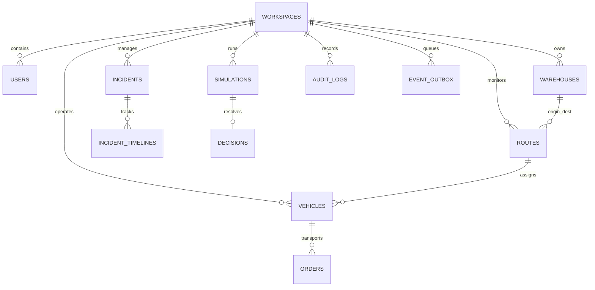

# NEXUS Database Architecture & Schema Specification

This document details the data models, relational architecture, transactional guarantees, optimistic concurrency control, and transactional outbox patterns powering the NEXUS platform.

---

## 1. Relational Architecture & Entity Hierarchy

NEXUS models an enterprise logistics topology with strict multi-tenant workspace isolation:



---

## 2. Table Specifications & Schemas

### 2.1 Identity, Workspace & Access Governance
- **`workspaces`**: Tenant boundary for enterprise fleets.
  - `id` (UUID / String, PK)
  - `name` (String, 255)
  - `slug` (String, unique, indexed)
  - `type` (Enum: `ENTERPRISE`, `REGIONAL`, `DEMO`)
  - `region` (String, e.g., `US-WEST`, `EU-CENTRAL`)
  - `scale` (Enum: `REGIONAL_FLEET`, `CONTINENTAL_LOGISTICS`, `GLOBAL_SUPPLY_CHAIN`)
  - `is_demo` (Boolean, default: false)
  - `is_active` (Boolean, default: true)
  - `created_at` / `updated_at` (DateTime, UTC)

- **`users`**: Platform operators and administrators.
  - `id` (UUID / String, PK)
  - `clerk_user_id` (String, unique, nullable, indexed)
  - `email` (String, unique, indexed)
  - `hashed_password` (String, salted bcrypt hash)
  - `name` (String, 255)
  - `role` (Enum: `ADMINISTRATOR`, `OPERATIONS_MANAGER`, `ANALYST`, `OPERATOR`)
  - `department` (String, e.g., `Fleet Operations`, `Safety & Compliance`)
  - `onboarding_status` (Enum: `PENDING`, `COMPLETED`)
  - `is_active` (Boolean, default: true)
  - `created_at` / `updated_at` (DateTime, UTC)

- **`workspace_memberships`**: RBAC permissions scoped by workspace.
  - `id` (UUID, PK)
  - `workspace_id` (FK -> `workspaces.id`, indexed)
  - `user_id` (FK -> `users.id`, indexed)
  - `role` (String)

- **`avatar_preferences`**: User-specific 3D companion settings.
  - `id` (UUID, PK)
  - `user_id` (FK -> `users.id`, unique)
  - `enabled` (Boolean, default: true)
  - `reduced_motion` (Boolean, default: false)
  - `companion_hints_enabled` (Boolean, default: true)
  - `sound_enabled` (Boolean, default: true)
  - `avatar_variant` (String, default: `tactical_orb`)

- **`clerk_webhook_events`**: Idempotency ledger for incoming identity webhooks.
  - `id` (UUID, PK)
  - `clerk_event_id` (String, unique, indexed)
  - `event_type` (String, e.g., `user.created`, `user.updated`)
  - `status` (Enum: `RECEIVED`, `PROCESSED`, `FAILED`)
  - `payload` (JSONB / Text)
  - `last_error` (Text, nullable)
  - `created_at` (DateTime, UTC)

---

### 2.2 Operational Digital Twins & Telemetry
- **`warehouses`**: Distribution centers and fulfillment hubs.
  - `id` (UUID, PK)
  - `workspace_id` (FK -> `workspaces.id`, indexed)
  - `code` (String, unique within workspace, e.g., `WH-DENVER-01`)
  - `name` (String)
  - `city` / `country` (String)
  - `lat` / `lng` (Float, coordinates)
  - `capacity_units` (Integer)
  - `current_units` (Integer)
  - `dock_count` (Integer)
  - `active_docks` (Integer)
  - `version` (Integer, default: 1, OCC counter)

- **`vehicles`**: Heavy-duty haulers and autonomous trucks.
  - `id` (UUID, PK)
  - `workspace_id` (FK -> `workspaces.id`, indexed)
  - `code` (String, unique within workspace, e.g., `NX-104`)
  - `name` (String)
  - `model` (String, e.g., `Freightliner eCascadia`, `Tesla Semi`)
  - `driver_name` (String, nullable)
  - `status` (Enum: `IDLE`, `EN_ROUTE`, `MAINTENANCE`, `CHARGING`, `ALERT`)
  - `current_lat` / `current_lng` (Float)
  - `speed_kmh` (Float)
  - `battery_pct` (Float, 0.0 - 100.0)
  - `health_score` (Float, 0.0 - 100.0)
  - `assigned_route_id` (FK -> `routes.id`, nullable)
  - `version` (Integer, default: 1, OCC counter)

- **`routes`**: Highway corridors connecting distribution nodes.
  - `id` (UUID, PK)
  - `workspace_id` (FK -> `workspaces.id`, indexed)
  - `code` (String, e.g., `RT-I70-DEN-SLC`)
  - `name` (String)
  - `origin_warehouse_id` (FK -> `warehouses.id`)
  - `dest_warehouse_id` (FK -> `warehouses.id`)
  - `distance_km` (Float)
  - `avg_duration_mins` (Float)
  - `traffic_condition` (Enum: `OPTIMAL`, `MODERATE`, `CONGESTED`, `HAZARDOUS`)
  - `waypoints` (JSONB / Text, array of lat/lng coordinates)
  - `version` (Integer, default: 1, OCC counter)

- **`orders`**: High-priority consignments and cargo manifests.
  - `id` (UUID, PK)
  - `workspace_id` (FK -> `workspaces.id`, indexed)
  - `order_number` (String, unique, e.g., `ORD-2026-9812`)
  - `customer_name` (String)
  - `destination` (String)
  - `priority` (Enum: `STANDARD`, `EXPEDITED`, `CRITICAL_COLD_CHAIN`)
  - `status` (Enum: `QUEUED`, `LOADED`, `IN_TRANSIT`, `DELIVERED`, `DELAYED`)
  - `total_cost` (Float, USD)
  - `deadline` (DateTime, UTC)
  - `vehicle_id` (FK -> `vehicles.id`, nullable)
  - `version` (Integer, default: 1, OCC counter)

---

### 2.3 Incidents, Simulations & Decisions
- **`incidents`**: Operational bottlenecks, severe weather impasses, and breakdowns.
  - `id` (UUID, PK)
  - `workspace_id` (FK -> `workspaces.id`, indexed)
  - `code` (String, e.g., `INC-7402`)
  - `title` (String, 255)
  - `summary` (Text)
  - `severity` (Enum: `LOW`, `MEDIUM`, `HIGH`, `CRITICAL`)
  - `status` (Enum: `DETECTED`, `ANALYZING`, `SIMULATING`, `RESOLVING`, `RESOLVED`)
  - `affected_entity_type` (Enum: `VEHICLE`, `ROUTE`, `WAREHOUSE`)
  - `affected_entity_id` (String)
  - `delay_minutes` (Integer)
  - `cost_estimate` (Float)
  - `root_cause_analysis` (Text, nullable, AI-generated)
  - `version` (Integer, default: 1, OCC counter)

- **`incident_timelines`**: Immutable chronological triage event log.
  - `id` (UUID, PK)
  - `incident_id` (FK -> `incidents.id`, indexed)
  - `status` (String)
  - `note` (Text)
  - `actor_name` (String)
  - `created_at` (DateTime, UTC)

- **`simulations`**: What-If branching scenarios evaluated by physics engine.
  - `id` (UUID, PK)
  - `workspace_id` (FK -> `workspaces.id`, indexed)
  - `code` (String, e.g., `SIM-8910`)
  - `title` (String)
  - `incident_id` (FK -> `incidents.id`, nullable)
  - `status` (Enum: `PENDING`, `COMPLETED`, `APPLIED`, `REJECTED`)
  - `variables` (JSONB / Text: detour distance, speed limit, headwind speed, temperature)
  - `baseline_metrics` (JSONB / Text: time, cost, energy, SLA risk)
  - `simulated_metrics` (JSONB / Text: time, cost, energy, SLA risk, Pareto score)
  - `base_snapshot_version` (Integer, OCC snapshot check)
  - `version` (Integer, default: 1, OCC counter)

- **`decisions`**: Applied operational interventions.
  - `id` (UUID, PK)
  - `simulation_id` (FK -> `simulations.id`, unique)
  - `applied_by` (String, actor username or ID)
  - `applied_at` (DateTime, UTC)
  - `impact_summary` (Text)
  - `changes_json` (JSONB / Text, payload of committed state changes)
  - `version` (Integer, default: 1)

---

### 2.4 Eventing, Outbox & Audit Ledger
- **`event_outbox`**: Transactional outbox table ensuring reliable event publication.
  - `id` (UUID, PK)
  - `workspace_id` (String, indexed)
  - `event_type` (String, e.g., `DECISION_APPLIED`, `INCIDENT_ESCALATED`)
  - `aggregate_type` (String, e.g., `simulation`, `incident`, `vehicle`)
  - `aggregate_id` (String)
  - `payload` (JSONB / Text)
  - `attempts` (Integer, default: 0)
  - `processed_at` (DateTime, nullable)
  - `last_error` (Text, nullable)
  - `created_at` (DateTime, UTC, indexed)

- **`audit_logs`**: Immutable security and compliance ledger.
  - `id` (UUID, PK)
  - `workspace_id` (String, indexed)
  - `actor_id` (String)
  - `actor_name` (String)
  - `action` (String, e.g., `APPLY_DECISION`, `UPDATE_USER_ROLE`, `RESOLVE_INCIDENT`)
  - `entity_type` (String)
  - `entity_id` (String)
  - `details` (Text)
  - `metadata_json` (JSONB / Text)
  - `request_id` (String, nullable)
  - `created_at` (DateTime, UTC, indexed)

---

## 3. Concurrency Control & Stale State Prevention

NEXUS implements **Optimistic Concurrency Control (OCC)** across all mutable operational records. 

### Mutation Algorithm:
1. When an operator loads an incident or simulation, the client reads the entity's current `version`.
2. When submitting an intervention, the request carries `expected_version`.
3. The SQL UPDATE query executes:
   ```sql
   UPDATE incidents 
   SET status = :new_status, version = version + 1, updated_at = NOW()
   WHERE id = :id AND version = :expected_version;
   ```
4. If `rows_affected == 0`, a concurrent transaction has already mutated the entity. The backend immediately raises:
   ```json
   {
     "detail": "Entity has been modified by another operator. Please refresh.",
     "error_code": "SIMULATION_STALE",
     "current_version": 2
   }
   ```
   with HTTP Status `409 Conflict`.

---

## 4. Indexing & Query Optimization Strategy

- **Tenant Isolation**: All high-cardinality tables feature compound indices on `(workspace_id, status)` and `(workspace_id, created_at DESC)`.
- **Geospatial & Telemetry Lookups**: Fast filtering on `vehicles.status` and `warehouses.code`.
- **Audit Trails**: Reverse chronological indices on `audit_logs.created_at` and `operational_events.occurred_at` support sub-50ms audit queries even with millions of rows.
- **Outbox Worker**: Filtered index on `event_outbox(created_at) WHERE processed_at IS NULL` guarantees zero-overhead polling for background workers.
