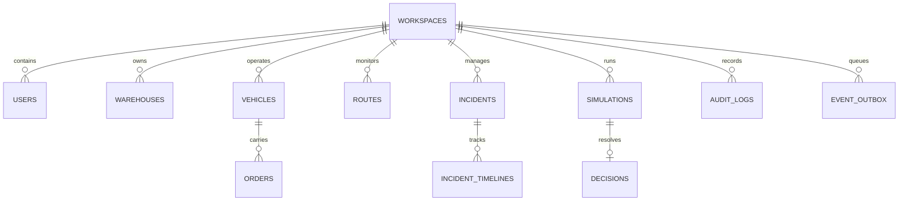

# NEXUS Database Architecture & Schema Specification

This document outlines the data model, transactional patterns, optimistic concurrency rules, and event outbox architecture used in NEXUS.

---

## 1. Database Model Hierarchy

---

## 2. Key Master Tables

### Identity & Workspace
- `workspaces`: Tenant boundary (`id`, `name`, `slug`, `type`, `region`, `scale`, `is_demo`, `is_active`).
- `users`: User identity mapped to Clerk (`id`, `clerk_user_id`, `email`, `name`, `role`, `department`, `onboarding_status`, `is_active`).
- `workspace_memberships`: User clearance within workspaces (`workspace_id`, `user_id`, `role`).
- `avatar_preferences`: Persistent user companion preferences (`enabled`, `reduced_motion`, `companion_hints_enabled`, `sound_enabled`, `avatar_variant`).
- `clerk_webhook_events`: Idempotency tracking table (`clerk_event_id`, `event_type`, `status`, `last_error`).

### Operations Telemetry
- `warehouses`: Logistics hub digital twins (`code`, `name`, `city`, `lat`, `lng`, `capacity_units`, `current_units`, `dock_count`, `active_docks`, `version`).
- `vehicles`: Fleet assets (`code`, `name`, `model`, `driver_name`, `status`, `current_lat`, `current_lng`, `speed_kmh`, `battery_pct`, `health_score`, `version`).
- `routes`: Inter-hub transportation corridors (`code`, `name`, `origin_warehouse_id`, `dest_warehouse_id`, `distance_km`, `avg_duration_mins`, `traffic_condition`, `waypoints`, `version`).
- `orders`: High-value consignments (`order_number`, `customer_name`, `destination`, `priority`, `status`, `total_cost`, `deadline`, `vehicle_id`, `version`).

### Incidents & Decision Simulations
- `incidents`: Operational bottlenecks and SLA risks (`code`, `title`, `summary`, `severity`, `status`, `affected_entity_type`, `affected_entity_id`, `delay_minutes`, `cost_estimate`, `version`).
- `incident_timelines`: Immutable chronological lifecycle events (`status`, `note`, `actor_name`, `created_at`).
- `simulations`: What-if branching scenarios (`code`, `title`, `status`, `variables`, `baseline_metrics`, `simulated_metrics`, `base_snapshot_version`, `version`).
- `decisions`: Applied operational interventions (`simulation_id`, `applied_by`, `applied_at`, `impact_summary`, `changes_json`, `version`).

### Eventing & Outbox Pattern
- `operational_events`: System-wide telemetry and state mutation ledger (`event_type`, `severity`, `entity_type`, `entity_id`, `message`, `occurred_at`).
- `event_outbox`: Transactional outbox queue processed by background workers (`event_type`, `aggregate_type`, `aggregate_id`, `payload`, `attempts`, `processed_at`, `last_error`).
- `audit_logs`: Immutable security and compliance log (`actor_id`, `actor_name`, `action`, `entity_type`, `entity_id`, `details`, `metadata_json`, `request_id`).

---

## 3. Concurrency & Stale Detection

All critical mutations enforce optimistic concurrency control via integer version counters (`version: int`). If the version of an entity has advanced since a simulation was created, the mutation is rejected with `HTTP 409 SIMULATION_STALE`, preventing accidental overwrites of live operations.
