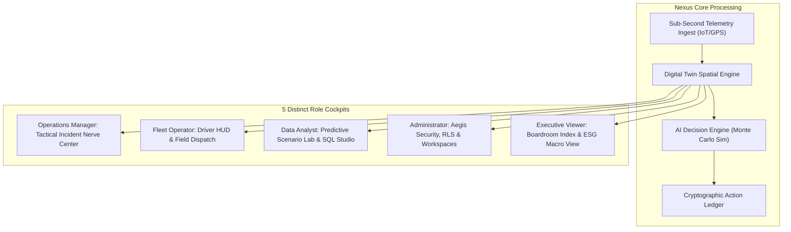
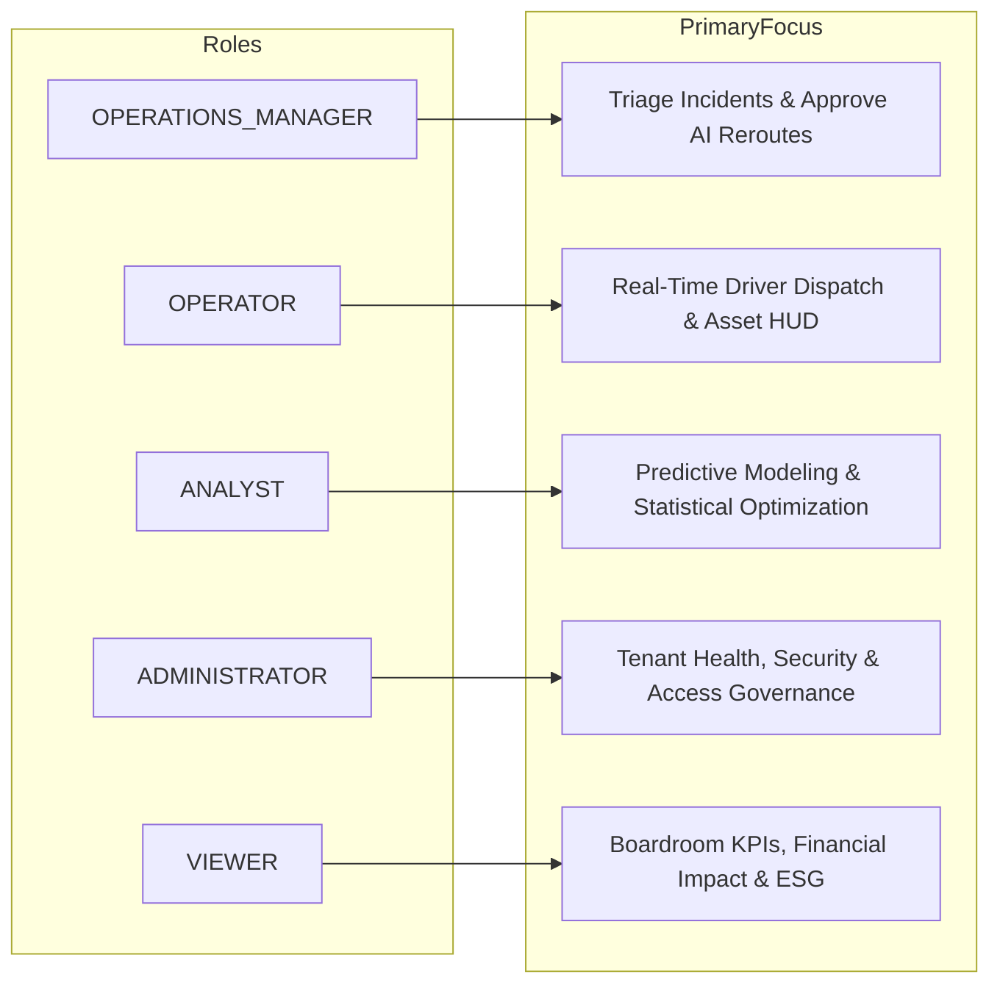
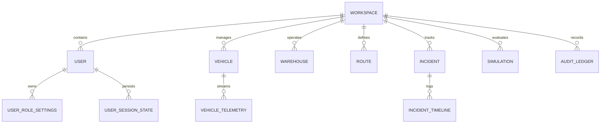
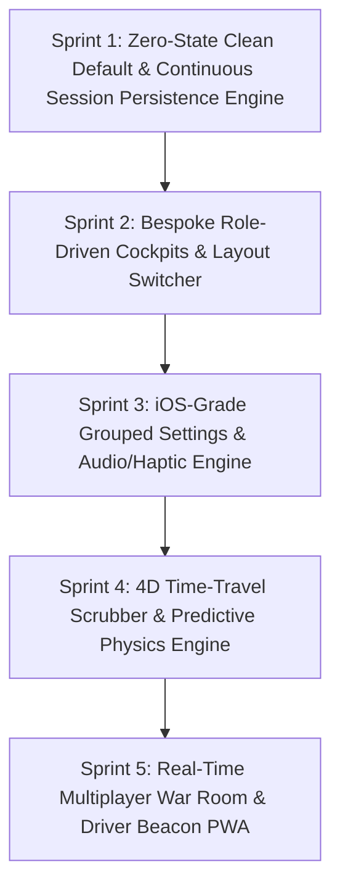

# NEXUS: Complete Role-Driven Architecture, Feature Roadmap & iOS-Grade Design Blueprint

---

## 1. Executive Summary & Core Platform Differentiator

### 1.1 The Nexus Market Differentiator
Traditional Supply Chain & Logistics platforms (e.g., Samsara, Project44, Flexport, Manhattan TMS) are **reactive visibility tools** or **clunky legacy ERP interfaces**. They report *after* an incident has occurred and require manual Excel juggling and phone calls to resolve.

**NEXUS is an Autonomous Logistics Operating System with a Real-Time Digital Twin & Predictive Decision Engine.**

```
┌──────────────────────────────────────────────────────────────────────────────────┐
│                             THE NEXUS DIFFERENTIATOR                             │
├──────────────────────────┬───────────────────────────────────────────────────────┤
│ Traditional Logistics    │ NEXUS Digital Twin Platform                           │
├──────────────────────────┼───────────────────────────────────────────────────────┤
│ Reactive alert pings     │ Predictive preemption (AI simulates bottlenecks ahead)│
│ Monolithic single view   │ 5 bespoke role cockpits (Manager, Operator, Analyst,  │
│                          │ Admin, Executive Viewer)                             │
│ Clunky enterprise UI     │ Apple-grade tactile design (iOS grouped hierarchy,    │
│                          │ SF-grade typography, subtle haptics/audio)            │
│ Manual route recalculate │ 1-Click Monte Carlo AI simulation + auto-rerouting    │
│ Generic database tables  │ Role-partitioned PostgreSQL views & sub-second query  │
│                          │ materialized layers                                   │
│ Hardcoded seed data      │ Zero-state clean default for all new accounts with   │
│                          │ continuous auto-saving session persistence            │
└──────────────────────────┴───────────────────────────────────────────────────────┘
```

---

## 2. Zero-State Clean Default & Continuous Session Persistence Engine

### 2.1 The "Default-to-Zero" Multi-Tenant Rule
* **No Pre-Polluted Seed Data for New Tenants**: When a new user registers or creates an organization, their operational tables (`vehicles`, `incidents`, `warehouses`, `orders`, `simulations`) start at **zero**.
* **Dual Operational Modes**:
  1. **Clean Production Mode (Default)**: Clean zero-state with tailored Apple-style empty states, quick-start wizards (CSV Import, Add Asset, Setup Hub).
  2. **Sandbox / Demo Sandbox Mode (Optional)**: A toggleable sandbox environment pre-populated with simulated scenarios (e.g., Chicago Blizzard, Dehradun Express Corridor) allowing users to safely test features without touching production data.

```
┌─────────────────────────────────────────────────────────────────────────────────┐
│                    NEW USER WORKSPACE INITIALIZATION FLOW                       │
├─────────────────────────────────────────────────────────────────────────────────┤
│ 1. User Signs Up ──► Workspace Created (State = Clean Zero)                     │
│ 2. Role Selected  ──► Load Role-Specific Zero-State Dashboard Layout            │
│ 3. Empty States   ──► [Import CSV / ERP] or [Enable Interactive Sandbox Demo]   │
│ 4. Work Session   ──► Continuous Auto-Checkpointing to PostgreSQL & Redis Cache │
│ 5. Session Exit   ──► State Saved; Instant 100% Resume upon next login          │
└─────────────────────────────────────────────────────────────────────────────────┘
```

### 2.2 Continuous Session Persistence Architecture
To ensure zero data loss and seamless cross-device continuity, Nexus implements an active **Session State Checkpoint Engine**:

```prisma
// User Work Session & UI State Checkpoint Model
model UserSessionState {
  id              String   @id @default(uuid())
  userId          String   @unique
  user            User     @relation(fields: [userId], references: [id], onDelete: Cascade)
  workspaceId     String
  
  // Viewport & Spatial State
  activeRoute     String   @default("/overview")
  lastMapCenterLat Float?
  lastMapCenterLng Float?
  lastMapZoom     Float?
  
  // Operational Workspace State
  selectedFilters Json     @default("{}") // { severity: ["HIGH", "CRITICAL"], fleetStatus: "IN_TRANSIT" }
  draftSimulation Json?    // Unsaved Monte Carlo simulation in-progress
  activeIncidentId String? // Last inspected incident modal
  
  // Custom Dashboard Layout Preferences
  pinnedWidgets   String[] @default(["sla_countdown", "fleet_health", "chokepoint_map"])
  collapsedPanels String[] @default([])
  
  // Persistence Metadata
  lastSavedAt     DateTime @default(now())
  updatedAt       DateTime @updatedAt

  @@index([workspaceId, userId])
}
```

---

## 3. Comprehensive Feature Audit & Gap Analysis



### 3.1 Feature Audit Matrix

| Module | Current State | Missing Gaps & Required Working | Priority |
| :--- | :--- | :--- | :--- |
| **Workspace Default State** | Hardcoded mock seed for all users | **Default-to-Zero clean tenancy**: Zero data state on new signup with CSV import wizard and optional Sandbox toggle. | **P0** |
| **Session Persistence** | Lost on refresh / basic localStorage | **Server-side Session Checkpoint Engine**: Auto-save viewport, drafts, filters, and resume instantly on any device. | **P0** |
| **Live Telemetry & Digital Twin** | Static 3D Globe + Basic Map | Live WebSocket/SSE streaming pipe, sub-second GPS heading interpolation, geofence trigger engine, real cold-chain temperature alerts. | **P0** |
| **Incident Engine** | Static list + basic status change | Auto-incident creation via sensor anomalies, cascading delay computation, automated carrier notification dispatch. | **P0** |
| **Scenario Simulator** | Pre-canned simulation card | Interactive parameter tuning (weather penalty, fuel price surge, driver hours), Monte Carlo run comparison, one-click production sync. | **P0** |
| **Role-Specific Dashboards** | Shared overview for all users | Dedicated landing views tailored to each role's cognitive load and operational responsibilities. | **P0** |
| **iOS-Grade Settings Hierarchy** | Basic flat form | Grouped iOS-style settings with role-scoped config cards, passkey management, offline sync buffer, haptic/audio settings. | **P1** |

---

## 4. The 5 Roles: Distinct Dashboards & Workflows

Each role has a fundamentally different mental model, daily goals, and action requirements:



---

### 4.1 Role 1: `OPERATIONS_MANAGER` (Tactical Incident Commander)
* **Goal**: Minimize SLA penalties, prevent cargo delays, resolve route bottlenecks within 90 seconds.
* **Working**:
  1. Opens the **Tactical Command Center**.
  2. The dashboard surfaces only **active disruptions** ranked by financial impact (\$) and SLA risk.
  3. Clicking an incident opens the **Split-Screen AI Resolver**: Left side displays the live GIS corridor with delayed trucks; right side displays the **AI Simulation Comparison** (Current ETA/Cost vs. Simulated Reroute ETA/Cost).
  4. With 1-click on `[Execute Reroute]`, the system dispatches updated waypoints to the driver's device and updates all affected orders.
* **Key Widgets**:
  - *SLA Breach Countdown Queue*
  - *Fleet Bottleneck Heatmap*
  - *One-Click AI Decision Approver*
  - *Warehouse Dock Equilibrium Gauge*

---

### 4.2 Role 2: `OPERATOR` / Field Dispatcher & Driver Hub
* **Goal**: Manage driver shifts, monitor real-time vehicle diagnostics, handle dock check-ins and emergency SOS events.
* **Working**:
  1. Opens the **High-Density Field Dispatch HUD**.
  2. Ultra-lean, high-contrast, keyboard-navigable interface (optimized for field control rooms with hotkeys: `[Space]` = Acknowledge, `[D]` = Dispatch, `[R]` = Call Driver).
  3. Real-time telemetry feed showing battery percentage, tyre pressure, cold chain temperature compliance, and live GPS speed.
  4. Quick-action modal for driver SOS breakdowns with nearest mechanic / tow dispatch routing.
* **Key Widgets**:
  - *Live Driver Telemetry Stream (Speed, Battery, Cold-Chain)*
  - *Dock Inbound/Outbound Manifest Queue*
  - *Emergency Dispatch & Geo-Fence Breach Panel*
  - *Active Driver Shift & Rest-Time Tracker*

---

### 4.3 Role 3: `ANALYST` (Supply Chain Data Scientist)
* **Goal**: Discover operational inefficiencies, run multi-variate what-if models, optimize route economics and fuel/carbon metrics.
* **Working**:
  1. Opens the **Predictive Intelligence & Scenario Lab**.
  2. Visual Query & Parameter Builder: Configures custom simulations (e.g., "+15% fuel inflation + winter blizzard on corridor Midwest-04").
  3. Interactive Monte Carlo regression curves showing expected delay distribution across 10,000 runs.
  4. Direct SQL/GraphQL query sandbox to export clean analytics datasets to Jupyter/PowerBI/Python.
* **Key Widgets**:
  - *Monte Carlo Simulation Comparison Studio*
  - *Carrier Cost Regression & Fuel Variance Curves*
  - *Historical Bottleneck & Chokepoint Clustering*
  - *Carbon Footprint & ESG Route Optimizer*

---

### 4.4 Role 4: `ADMINISTRATOR` (Infrastructure, Security & Governance)
* **Goal**: Ensure 99.99% system uptime, enforce biometric/passkey policies, manage tenant workspaces, and monitor API rate limits.
* **Working**:
  1. Opens the **Aegis System Governance Matrix**.
  2. Live pipeline throughput monitor (Azure IoT Hub ingestion latency, Redis queue health, PostgreSQL query duration).
  3. Multi-tenant user permission matrix with role assignment, SAML/SSO configuration, and hardware passkey enforcement.
  4. Cryptographic Audit Trail Ledger inspecting every automated AI decision and human override with IP, timestamp, and signed payload.
* **Key Widgets**:
  - *Data Pipeline Health & Latency Monitor*
  - *Role-Based Access Control (RBAC) & Team Invites*
  - *Cryptographic Action Audit Ledger*
  - *API Keys, Webhooks & Rate Limit Governor*

---

### 4.5 Role 5: `VIEWER` (Executive / C-Suite & Client Stakeholders)
* **Goal**: Macro visibility of organizational efficiency, margin protection, carbon reduction, and board-ready executive summaries.
* **Working**:
  1. Opens the **Executive Boardroom Suite**.
  2. Clean, clutter-free, aesthetic presentation layout featuring macro KPIs: Net Delivery Margin, Global On-Time Delivery Rate (OTD), Total Fleet Emissions Saved.
  3. One-click `[Generate Executive PDF Briefing]` with natural-language AI executive summaries ready for stakeholder distribution.
* **Key Widgets**:
  - *Macro Financial & Operational Efficiency Index*
  - *Global ESG & Carbon Savings Tracker*
  - *Executive Risk & Network Resilience Score*
  - *Automated Daily / Weekly PDF Briefing Generator*

---

## 5. Next-Level Problem-Solving Innovations

To elevate NEXUS into a category-defining enterprise platform, 6 breakthrough capabilities are engineered directly into the core architecture:

### 5.1 "4D Time-Travel" Telemetry Scrubber (Historical Replay & Predictive Forward Horizon)
* **Problem**: Dispatchers struggle to understand how an incident evolved over the past 6 hours and cannot visualize when a future bottleneck will peak.
* **Solution**: A video-grade timeline scrubber below the 3D globe / map:
  - **Dragging Left (Past 24h)**: Replays historical vehicle GPS tracks, sensor telemetry, and incident escalation in exact chronological playback.
  - **Dragging Right (Future +1h, +6h, +24h)**: Runs the predictive spatial physics engine forward to render forecasted weather fronts, projected truck locations, and impending warehouse dock chokepoints.

### 5.2 Real-Time Multiplayer War Room (Figma-Style Presence & Collaborative Triage)
* **Problem**: Operations managers, dispatchers, and warehouse supervisors communicate across fragmented phone calls, Slack messages, and static screenshots.
* **Solution**: Live multiplayer presence on the Digital Twin:
  - View real-time user avatars and cursors actively inspecting specific corridors or vehicles on the 3D globe.
  - Shared **Live Incident Canvas** where the team can co-annotate satellite routes, pin voice notes, and co-sign emergency reroute approvals in real time.

### 5.3 Hands-Free Voice Copilot & Spatial Audio HUD (Apple Siri / CarPlay Grade)
* **Problem**: Field dispatchers in high-pressure rooms suffer from severe visual cognitive overload.
* **Solution**: Low-latency conversational AI copilot with speech synthesis:
  - Say: *"Nexus, what is our total financial risk in the Midwest corridor right now?"*
  - Copilot responds verbally with concise figures, automatically shifts the 3D viewport to the affected freight, highlights the bottleneck in red, and stages a reroute scenario.

### 5.4 Offline-First Local Cache with CRDT Conflict Resolution
* **Problem**: Warehouse docks and remote mountain highway corridors have intermittent connectivity, leading to dropped actions and desynchronized manifests.
* **Solution**: Full local-first IndexedDB cache. Operators can complete check-ins, record cargo scans, and modify delivery statuses offline. The background sync worker uses Conflict-Free Replicated Data Types (CRDTs) to seamlessly merge updates the millisecond connectivity returns.

### 5.5 Driver "Beacon Pass" (Zero-Install Mobile PWA & Apple Wallet)
* **Problem**: 3rd-party contracted drivers refuse to download heavy enterprise applications.
* **Solution**: 1-click generation of a lightweight mobile web link or Apple/Google Wallet pass:
  - Instant turn-by-turn bypass navigation.
  - Digital contactless signature capture upon delivery.
  - Automated GPS proof-of-delivery (PoD) uploaded directly to the Nexus audit ledger.

### 5.6 Spatial Geofence Hazard Painter
* **Problem**: Fixed routes fail when sudden real-world hazards emerge (flash floods, road closures, strikes).
* **Solution**: Dispatchers can draw custom polygon geofences or avoidance polygons directly onto the 3D map. Any vehicle approaching the danger perimeter triggers an automated audio alarm and recalculates an optimized avoidance route.

---

## 6. Role-Optimized Database Architecture (PostgreSQL)

To enable zero-latency dashboard rendering for each distinct role, the database architecture combines **Row-Level Security (RLS)**, **partitioned telemetry hyper-tables**, and **specialized materialized views**.



### 6.1 Schema Extensions for Role Isolation & Settings

```prisma
// Specialized Role Preferences & iOS-Grade Settings Model
model UserRoleSettings {
  id              String   @id @default(uuid())
  userId          String   @unique
  user            User     @relation(fields: [userId], references: [id], onDelete: Cascade)
  role            Role
  
  // Appearance & Tactile
  theme           String   @default("system") // dark, light, midnight, system
  hapticFeedback  Boolean  @default(true)
  soundEffects    Boolean  @default(true)
  reducedMotion   Boolean  @default(false)
  densityMode     String   @default("comfortable") // compact, comfortable, spacious
  
  // Notification Toggles (iOS Grouped Style)
  pushCritical    Boolean  @default(true)
  pushWarning     Boolean  @default(true)
  pushAiBriefing  Boolean  @default(false)
  emailDigest     String   @default("daily") // instant, daily, weekly, never
  soundAlertLevel String   @default("high")
  
  // Role-Specific Granular Configurations (JSON)
  roleConfigJson  Json     @default("{}")
  
  // Offline Sync & Local Cache
  offlineSyncEnabled Boolean @default(true)
  cacheRetentionDays  Int     @default(7)
  
  createdAt       DateTime @default(now())
  updatedAt       DateTime @updatedAt
}

// Telemetry Streaming Partition Table
model VehicleTelemetryStream {
  id          BigInt   @id @default(autoincrement())
  vehicleId   String
  workspaceId String
  lat         Float
  lng         Float
  speedKmh    Float
  heading     Float
  batteryPct  Float
  cargoTempC  Float?
  tirePsi     Float?
  recordedAt  DateTime @default(now())

  @@index([workspaceId, recordedAt(sort: Desc)])
  @@index([vehicleId, recordedAt(sort: Desc)])
}

// Immutable Cryptographic Audit Ledger
model AuditChainLedger {
  id            String   @id @default(uuid())
  workspaceId   String
  actorId       String
  actorRole     Role
  actionType    String   // SIMULATION_EXECUTED, REROUTE_DISPATCHED, INCIDENT_OVERRIDDEN
  targetEntity  String
  targetId      String
  previousState Json
  newState      Json
  reason        String?
  sha256Hash    String   // Cryptographic proof
  previousHash  String?
  timestamp     DateTime @default(now())

  @@index([workspaceId, timestamp(sort: Desc)])
}
```

### 6.2 Materialized Views for Instant Role Queries

1. **`v_manager_incident_cockpit`**: Aggregates active high-severity incidents, calculating impacted revenue and simulation readiness in under 5ms.
2. **`v_operator_live_fleet`**: Filters current position, heading, driver status, and battery percentage of all operational vehicles with geospatial bounding-box indexing.
3. **`v_analyst_corridor_efficiency`**: Pre-aggregates 30-day historical corridor delays, fuel variance, and weather impact coefficients.
4. **`v_executive_macro_kpis`**: Pre-computed hourly snapshots of Global On-Time Delivery (OTD), Carbon Saved (kg), and Total Cost Savings.

---

## 7. iOS-Grade Settings System: Structure & UX Depth

To deliver the polish of an official iOS native application, the settings experience follows Apple's Human Interface Guidelines (HIG) with grouped inset cards, smooth toggle animations, haptic/audio confirmation, and deep role-scoped configurability.

```
┌────────────────────────────────────────────────────────────┐
│ ⚙️ SETTINGS (iOS Grouped Structure)                         │
├────────────────────────────────────────────────────────────┤
│ [👤 Profile & Workspace]  ──► Active Role, Passkey, Hub    │
│ [🎨 Appearance & Sound]   ──► Tactile Audio, Dark/Light    │
│ [🔔 Notifications]        ──► Critical Alerts, Push Rules  │
│ [🎯 Role Preferences]     ──► Tailored to Active Role      │
│ [🛡️ Security & Privacy]   ──► Hardware Keys, Session Locks │
│ [💾 Data & Storage]       ──► Local Cache, Offline Buffer  │
└────────────────────────────────────────────────────────────┘
```

### 7.1 Role-Specific Settings Matrix

```
1. OPERATIONS MANAGER SETTINGS:
   ├─ Autonomy & AI Decision Thresholds (Slider: 50% - 99%)
   ├─ Auto-Reroute Cost Cap (e.g., $5,000 auto-approve limit)
   ├─ SLA Penalty Escalation Alerts (Audio chime on Critical)
   └─ Corridor Congestion Sensitivity (Low / Medium / High)

2. FLEET OPERATOR SETTINGS:
   ├─ Real-Time HUD Refresh Rate (1s, 2s, 5s)
   ├─ Night Driving & High-Contrast Map Mode (Toggle)
   ├─ Voice Copilot Sensitivity & Hands-Free Hotkeys
   └─ Emergency SOS Auto-Dial Dispatcher (Toggle)

3. SUPPLY CHAIN ANALYST SETTINGS:
   ├─ Monte Carlo Default Iterations (1,000 / 5,000 / 10,000)
   ├─ Default Risk Confidence Interval (90% / 95% / 99%)
   ├─ Data Export Format Defaults (CSV / Parquet / JSON / Excel)
   └─ External API Sync (Jupyter / Databricks / Snowflake Webhook)

4. SYSTEM ADMINISTRATOR SETTINGS:
   ├─ Biometric / Passkey Hardware Enforcement (WebAuthn / FIDO2)
   ├─ Data Pipeline Latency Threshold Alerts
   ├─ Role-Based Access Control (RBAC) Policy Overrides
   └─ Audit Ledger Retention & Export Policy (30d / 90d / 7yr)

5. EXECUTIVE VIEWER SETTINGS:
   ├─ Currency & Regional Financial Units (USD, EUR, GBP, INR)
   ├─ Board Briefing Schedule (Daily 8:00 AM PDF delivery)
   ├─ Macro KPI Dashboard Priority Sorting
   └─ ESG & Carbon Offsetting Benchmark Index
```

---

## 8. Implementation Roadmap


